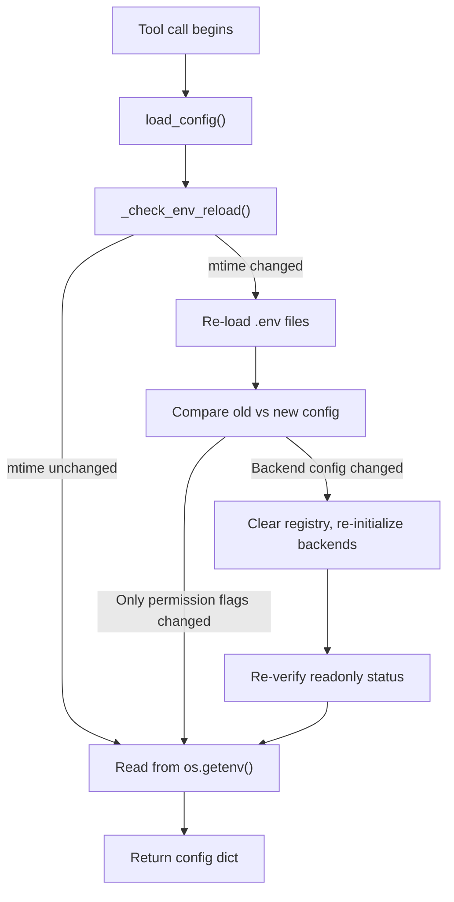

<!-- BEGIN HEADER -->
# Decision Log

A reverse-chronological journal of architectural and strategic decisions.
Maintained by AI coding agents (and human developers) at the end of working
sessions. Each entry captures what was decided, what alternatives were
considered, and why — so future contributors never revisit dead ends or lose
context on trade-offs already evaluated.

Agents: read this file before working on any module referenced here.

### When to log

Log decisions that constrain future design, involved genuine alternatives,
or would be non-obvious to a future contributor. A good litmus test: does
the "What this rules out" section have something meaningful to say?

Do NOT log: bug fixes with obvious solutions, test-only refactors,
documentation updates, or minor config tweaks that don't affect
architecture.

### Entry format

Insert new entries directly below this header, newest first. Do not modify
or reorder existing entries except to add supersession notes (see below).
If a session produced multiple independent decisions, create a separate
entry for each.

**Year-end summaries:** When the log rolls into a new calendar year, add
a summary entry titled "Summary of [previous year] decisions" that
briefly describes each decision from that year in one line. This gives
agents scanning forward a checkpoint before older entries.

```
---

## YYYY-MM-DD — [Short descriptive title]

**Trigger**: What problem, requirement, or situation prompted this work.

**Options explored**:
- For each option, name the approach, its strengths, and why it was or
  wasn't chosen. Include options that were tried and reverted.

**Decision**: What was chosen and the core trade-off.

**What this rules out**: Future directions now constrained or foreclosed.
What would trigger revisiting this decision.

**Relevant files**: Key files created or modified.
```

### Guidelines

- Focus on **why**, not what. The diff shows what changed; this log
  explains the reasoning.
- Capture rejected alternatives with equal care. Future agents need to
  know what was already tried.
- Be specific — name libraries, files, config choices, error messages.
- Aim for 10–50 lines per entry. Reference document, not narrative.
- Plain language. No jargon, no editorializing, no padding.

### Superseded entries

When a new decision invalidates, corrects, or replaces guidance in an older
entry, add a blockquote annotation to the affected older entry — do not
rewrite or delete its original text. Place the note immediately after the
entry's heading or after the paragraph containing the superseded claim.

> **⚠ Superseded** (YYYY-MM-DD): [Brief explanation of what changed and
> why.] See "[title of newer entry]" above.

Use **⚠ Partially superseded** when only specific claims are affected, and
**⚠ Superseded** when the entire entry's premise or decision has been
overturned. Always scan older entries for claims that conflict with the new
decision — agents reading the log linearly will otherwise encounter
contradictory guidance.
<!-- END HEADER -->

---

## 2026-06-23 — Agent-supplied workspace_root for Cursor shared MCP process

**Trigger**: With multiple Cursor windows open, user-level stdio MCP servers run in a single `[Shared MCP process]` that multiplexes all windows onto one session. `roots/list` returned a sibling project's folder (`C:\Repos\msaccess-vcs-addin`) for db-if-portal-sync tool calls, loading the wrong `.env` and backends. Process CWD was the user home directory; no documented Cursor setting disables shared-process mode.

**Options explored**:
- **Per-project `.cursor/mcp.json` with `${workspaceFolder}`** — would pin cwd/env per repo but rejected as primary fix (extra per-repo setup for every consumer).
- **Server-generated session ID over stdio** — server cannot influence Cursor's broker routing; shared process collapses windows before the server sees them.
- **streamable-HTTP transport spike** — HTTP is multi-session by design (`Mcp-Session-Id`); may give per-window sessions. Implemented as opt-in (`DB_MCP_TRANSPORT=http`) with `db_debug_session` + `spike.jsonl` for user verification before promoting HTTP as the recommended multi-window setup.
- **Agent-supplied `workspace_root` on tool calls (chosen primary fix)** — the agent always knows the Cursor Workspace Path; when provided, resolution trusts it over `roots/list` and session cache cannot cross-contaminate windows.

**Decision**: Add optional `workspace_root` parameter to all `@db_tool` tools (agent passes Cursor Workspace Path in multi-window setups). Resolution precedence: (1) agent-supplied path → `agent_supplied`, (2) launch pins `DB_MCP_PROJECT_DIR` / `WORKSPACE_FOLDER_PATHS`, (3) session cache validated against current roots, (4) `roots/list` candidates. Log every resolution to `~/.db-inspector-mcp/logs/resolution.jsonl` with source, raw roots, chosen root, session id, boot_id, pid. `db_list_databases` returns `workspace_root`, `resolved_via`, `session_id`. Stdio is the only supported transport; HTTP plumbing was removed after the spike confirmed it provides no benefit (see below).

**What this rules out**: Relying solely on `roots/list` or session cache in multi-window Cursor without agent confirmation. Using nested `.env` walk-up as the fix (wrong root was a sibling project, not a nested file).

**Spike result (2026-06-23, conclusive — HTTP does NOT help)**: Ran `db_debug_session` across three Cursor windows over streamable-HTTP, reading the transport-level `mcp-session-id` header plus a GC-safe per-session serial (`session_identity` via `WeakKeyDictionary`, fixing the earlier `id()` address-reuse flaw). All three windows (db-if-portal-sync, msaccess-vcs-addin, db-inspector-mcp) reported the **same `mcp_session_id`** (`ae605222…`), the **same `session_serial`** (`93d2c8fe…`), and `live_session_count: 1`. `roots/list` returned the **union of all open windows' folders** to every window, with no indication of the calling window. Conclusion: Cursor collapses all windows onto a single MCP session over **both** stdio and HTTP — there is no client- or transport-level per-window identifier. HTTP adds a manually-run server with zero isolation benefit. **`workspace_root` (agent-supplied) is the only reliable fix.** HTTP transport plumbing (`http_host`, `http_port`, `configure_http_settings`, conditional transport branch in `main.py`) was removed after the spike to reduce maintenance surface. `db_debug_session` and session-identity primitives remain for diagnostics. `configured_transport()` now unconditionally returns `"stdio"`.

**Relevant files**: `workspace.py`, `tools.py`, `config.py`, `resolution_logging.py`, `server_runtime.py`, `main.py`, `backends/registry.py`, `docs/CURSOR_SHARED_MCP.md`, `tests/test_workspace.py`, `tests/test_tools.py`, `tests/test_server_runtime.py`.

---

## 2026-06-12 — Adopt uv.lock + Dependabot + uv audit for dependency security

**Trigger**: No automated signal existed for out-of-date or vulnerable dependencies. `pyproject.toml` used `>=` floors with no lock file, so CI and local dev resolved different trees, and nothing detected CVEs on a timer — a security update would only be noticed if someone manually ran an audit.

**Options explored**:
- **pip-compile (pip-tools) lock + pip-audit in CI** — mature and pip-native, but adds a second toolchain alongside the uv already used for end-user distribution (`uvx`). `pip-compile --generate-hashes` produces platform-specific lockfiles, awkward for the `pywin32; sys_platform == 'win32'` marker on Windows-only CI runners.
- **Manifest-only with `>=` floors + manual `pip-audit`** — zero infra, but relies on remembering to run it; misses CVEs disclosed during quiet periods.
- **uv.lock + Dependabot `uv` ecosystem + `uv audit` (chosen)** — single toolchain; Dependabot has native uv support (version updates GA; security updates shipped 2025-12-16). `uv.lock` is a universal cross-platform lockfile that resolves platform markers conditionally.

**Decision**: Commit `uv.lock` for deterministic CI/dev resolution while keeping `pyproject.toml` floors unchanged for library/`uvx` consumers (the lock is a CI/dev artifact, not a constraint on consumers). Two detection layers: Dependabot (`uv` ecosystem, weekly, 7-day cooldown) as the passive detector that opens PRs/alerts, and a weekly scheduled `uv audit` CI job as the backstop that audits the full locked tree — including transitive deps, which Dependabot's uv dependency graph has historically parsed less reliably ([dependabot-core #11913](https://github.com/dependabot/dependabot-core/issues/11913)). Dev and CI both moved to uv (`uv sync --frozen`, `uv run`, `uv build`); the always-applied `.cursor/rules/testing.mdc` and docs were updated to match. No runtime/startup scanning — audits stay in CI only.

**What this rules out**: pip-compile/pip-tools and the venv+`pip install -e ".[dev]"` dev flow for this repo. Revisit if Dependabot's uv security graph proves unreliable (the `uv audit` backstop is the safety net) or if a non-Windows CI matrix is added. `uv audit` is currently experimental (invoked with `--preview-features audit-command`); if its CLI changes, the fallback is `uv export --format requirements-txt | uvx pip-audit -r -`.

**Relevant files**: `uv.lock`, `.github/dependabot.yml`, `.github/workflows/ci.yml`, `.github/workflows/publish.yml`, `CONTRIBUTING.md`, `AGENTS.md`, `README.md`, `.cursor/rules/testing.mdc`.

---

## 2026-06-12 — Robust workspace root discovery and failure logging

**Trigger**: Intermittent failures loading `db-if-portal-sync` `.env` in Cursor: `db_list_databases` returned empty after MCP restarts. Cursor sends bare Windows paths in `roots/list`; MCP SDK validates with `FileUrl` and rejects them. Recovery via regex on Pydantic error strings was fragile, failures occurred before workspace logging initialized (invisible in `usage.jsonl`), and session→workspace cache could stick to a stale root when client roots changed.

**Options explored**:
- **Regex-only recovery on `list_roots()` failure** — already present; works in unit tests but brittle across Pydantic versions and invisible when other steps fail.
- **Pre-validate by fetching raw `roots/list` JSON** — normalize bare paths to `file://` before `ListRootsResult` validation; also extract paths from Pydantic `ValidationError.errors()` and raw dict fallback.
- **Log failures only to stderr** — visible in Cursor MCP Logs but not in `usage.jsonl`; rejected for cross-project debugging.

**Decision**: Fetch raw `roots/list` when possible and normalize URIs before validation; layered fallback (Pydantic error inputs → regex → standard `list_roots()`). Log workspace resolution failures to default `~/.db-inspector-mcp/logs/usage.jsonl` before workspace logging is configured. Re-validate session cache against current client roots each call. Verbose stderr at each probe step.

**What this rules out**: Relying solely on post-validation regex recovery. Unconditional session-root caching without checking current client roots. Assuming workspace failures will appear in per-project logs.

**Relevant files**: `workspace.py`, `tools.py`, `usage_logging.py`, `tests/test_workspace.py`, `tests/test_logging.py`.

---

## 2026-06-12 — Fail-closed read-only gate (single flag)

**Trigger**: Two flags (`DB_MCP_VERIFY_READONLY` + `DB_MCP_READONLY_FAIL_ON_WRITE`) created a fail-open default: write-capable connections only warned, and inconclusive checks (timeout/error) silently passed even when the user expected a hard guard.

**Options explored**:
- **Add `DB_MCP_READONLY_FAIL_ON_INCONCLUSIVE`** — preserves today's default but adds a third flag.
- **Collapse to one flag, fail closed (chosen)** — `DB_MCP_VERIFY_READONLY=true` requires every verifiable backend to be confirmed read-only; write-detected or inconclusive both block startup. `DB_MCP_VERIFY_READONLY=false` is explicit approval to skip. Access backends remain exempt (not applicable ≠ inconclusive).

**Decision**: Remove `DB_MCP_READONLY_FAIL_ON_WRITE`. Fail on write-detected and inconclusive when verification is enabled. Access `sql_dialect == "access"` skip unchanged.

**What this rules out**: Warn-only read-only posture at default settings. Users with write-capable dev connections must set `DB_MCP_VERIFY_READONLY=false` or fix permissions.

**Relevant files**: `readonly.py`, `config.py`, `main.py`, `README.md`, `.env.example`, `tests/test_readonly.py`.

---

## 2026-06-12 — NoDatabaseConfigError for startup deferral

**Trigger**: `build_registry_from_env` raised `ValueError` for both "no config keys" and "config present but all backends failed". `main.py` caught all `ValueError` as benign deferral, so genuine misconfiguration exited silently instead of `sys.exit(1)`.

**Decision**: Introduce `NoDatabaseConfigError` for the empty-config case only. `main.py` defers on that exception; other `ValueError` (all backends failed) exits with an error message.

**Relevant files**: `config.py`, `main.py`, `tests/test_config.py`.

---

## 2026-06-12 — Postgres CTE wrapping and TOP/LIMIT token guards

**Trigger**: Postgres `count_query_results`/`get_query_columns`/`sum_query_column` wrapped entire CTE queries in subqueries (syntax error). MSSQL/Postgres row caps used substring checks (`"TOP "` / `"LIMIT"`), bypassed by literals like `'TOP SECRET'` or identifiers like `DELIMITER`.

**Decision**: Reuse `split_cte_prefix()` in Postgres wrap paths (aligned with MSSQL). Add `has_top_clause()` / `has_limit_clause()` with string-literal and keyword-boundary awareness; use in `inject_top_clause` and Postgres `preview`/`measure_query`.

**Relevant files**: `postgres.py`, `sql_utils.py`, `tests/test_sql_utils.py`, `tests/test_backends.py`.

---

## 2026-06-12 — Remove unused config and logging public helpers

**Trigger**: Audit found `load_config`, `get_config`, `get_backend`, `WorkspaceManager.invalidate_root`, and `get_log_file_path`/`is_logging_enabled` referenced only by tests — not the live workspace/MCP path. `config_from_env` also parsed logging keys never read from the config dict.

**Decision**: Remove the dead helpers and logging keys from `config_from_env`. Keep internal `_is_development_install()` (used by logging path resolution). Hot-reload uses per-workspace mtime tracking in `WorkspaceManager._get_or_build`.

**Relevant files**: `config.py`, `workspace.py`, `usage_logging.py`, `tests/test_config.py`.

---

## 2026-06-12 — Remove DB_MCP_ALLOW_PREVIEW flag

**Trigger**: `DB_MCP_ALLOW_PREVIEW` (global) and `DB_MCP_<NAME>_ALLOW_PREVIEW` (per-connection) were redundant with `DB_MCP_ALLOW_DATA_ACCESS`. Every data-access operation gates on the `db_preview` tool name — including `db_compare_queries(compare_samples=True)` — so the narrower preview flag unlocked the same surface area as the global data-access flag.

**Options explored**:
- **Keep both as forward-looking scaffolding** — preserves a fine-grained slot for future data tools, but adds config surface and documentation burden for no current benefit.
- **Remove ALLOW_PREVIEW** — single flag (`DB_MCP_ALLOW_DATA_ACCESS` + per-connection variant) for all data access. Simpler mental model; breaking change for anyone using only `ALLOW_PREVIEW`.

**Decision**: Remove `DB_MCP_ALLOW_PREVIEW` and `DB_MCP_<NAME>_ALLOW_PREVIEW`. `DB_MCP_ALLOW_DATA_ACCESS` is the sole data-access gate. Users who relied on `ALLOW_PREVIEW` must switch to `ALLOW_DATA_ACCESS`.

**What this rules out**: Per-tool data-access granularity until a new permission model is introduced (e.g. when additional data tools beyond preview/sample comparison are added). Would revisit if a second data tool needs independent gating.

**Relevant files**: `security.py`, `config.py`, `tools.py`, `.env.example`, `README.md`, `tests/test_security.py`.

---

## 2026-06-12 — db_tool FastMCP contract guards and Tool.run integration tests

**Trigger**: Repeated regressions after the per-workspace `db_tool` wrapper landed:
(1) `functools.wraps` hid `ctx`, so tools failed with "missing ctx"; (2) undeclared
`*args/**kwargs` leaked into the MCP JSON schema as required `args`/`kwargs`
fields; (3) unit tests called wrapped functions directly with `ctx=MagicMock()`,
bypassing `Tool.run()` schema validation and Context injection — so every fix
shipped green while Cursor still broke.

**Options explored**:
- **Rely on direct-call unit tests only** — fast but cannot see FastMCP metadata
  bugs; rejected after three invisible regressions.
- **Import-time contract assertion on each `@db_tool` registration (chosen)** —
  `_assert_tool_contract()` verifies `context_kwarg == "ctx"` and forbids
  `ctx`/`args`/`kwargs`/`self` in the published JSON schema.
- **Registry-driven `Tool.run` integration tests (chosen)** — invoke representative
  tools through `mcp._tool_manager.get_tool(name).run(...)` so schema validation
  and injection run for real.

**Decision**: Document the FastMCP introspection contract in `_workspace_wrapper`
(`__signature__` = `(ctx, <real params>)`, no `functools.wraps`, `__annotations__`
includes `Context`). Fail fast at import if any tool violates the contract. Add
`tests/test_tools_contract.py` with per-tool metadata checks and `Tool.run` tests.
Keep existing direct-call body tests in `test_tools.py` for fast logic coverage.

**What this rules out**: Changing `_workspace_wrapper` without updating contract
tests. Testing tools only via `await db_preview(ctx=..., ...)` without at least
one `Tool.run` path test for new tools.

**Relevant files**:
- `src/db_inspector_mcp/tools.py` — `_assert_tool_contract`, `_workspace_wrapper`
- `tests/test_tools_contract.py`

---

## 2026-06-11 — Revert MCP protocol diagnostics; keep stderr for Cursor visibility

**Trigger**: Manual testing in Cursor showed that `notifications/message` log
notifications (`Context.info()` etc.) produced **no output** in the MCP Logs
panel. Operational diagnostics disappeared entirely. stderr remains the only
channel Cursor reliably surfaces for stdio MCP servers (tagged `[error]`
regardless of content).

**Options explored**:
- **Dual-write (protocol + stderr)** — would restore visibility but duplicate
  every line once Cursor adds protocol log support. Deferred unless needed.
- **Keep MCP protocol logging only** — rejected; invisible in Cursor today.
- **Revert to `print(..., stderr)` (chosen)** — restores diagnostic visibility;
  accept Cursor's `[error]` tag on operational messages.

**Decision**: Removed `diagnostic_log.py` and restored direct stderr prints in
`workspace.py`, `config.py`, `readonly.py`, and `main.py`. Removed
`DB_MCP_DIAGNOSTIC_LOG_LEVEL` from `.env.example`.

**What this rules out**: Using MCP protocol logging as the sole diagnostic
channel until Cursor renders `notifications/message` in the Output panel.

**Cursor behavior (tested 2026-06-11)**: After implementing `Context.info()` /
`send_log_message` for lazy-init diagnostics, no messages appeared in Output
(MCP Logs / Shared MCP process). stderr output remained visible. This reflects
Cursor as of that date — protocol log notifications may be supported in a
future Cursor release; revisit then before removing stderr diagnostics.

**Relevant files**:
- `src/db_inspector_mcp/workspace.py`, `config.py`, `readonly.py`, `main.py`
- deleted `src/db_inspector_mcp/diagnostic_log.py`, `tests/test_diagnostic_log.py`

---

## 2026-06-11 — MCP protocol diagnostics instead of stderr for operational logs

> **⚠ Superseded** (2026-06-11): Cursor does not display MCP log notifications
> in the Output panel; diagnostics became invisible. Reverted to stderr.
> See "Revert MCP protocol diagnostics; keep stderr for Cursor visibility" above.

**Trigger**: Cursor's Shared MCP process labels all stderr output as `[error]`,
even for normal operational messages (workspace root recovery, backend
initialization, path resolution). Users could not distinguish real failures
from healthy lazy-init diagnostics.

**Options explored**:
- **Keep `print(..., stderr)`** — works but every message appears as `[error]` in
  Cursor. Rejected for operational noise.
- **Prefix stderr with `[INFO]`** — Cursor still tags the line `[error]`; prefix
  does not change client severity. Rejected.
- **`DB_MCP_DIAGNOSTIC_LOG_LEVEL` to suppress INFO** — reduces noise but does
  not fix mis-tagged severity. Useful as a complement only.
- **MCP `notifications/message` via FastMCP `Context.info()` (chosen)** — send
  leveled diagnostics through the protocol during tool calls when MCP session
  context is available; fall back to prefixed stderr only before handshake
  (eager startup).

**Decision**: Added `diagnostic_log.py` with `diag_info` / `diag_warning` /
`diag_error` helpers. `WorkspaceManager.get_registry_for()` binds the active
MCP `Context` and applies per-workspace `DB_MCP_DIAGNOSTIC_LOG_LEVEL`. Replaced
stderr prints in `workspace.py`, `config.py`, `readonly.py`, and `main.py`.
Failed MCP log delivery falls back to stderr without breaking tool execution.

**What this rules out**: Assuming stderr severity matches message intent in
Cursor. Backend connection-time prints in `access_com.py` / `access_odbc.py`
still use stderr until migrated separately.

**Relevant files**:
- `src/db_inspector_mcp/diagnostic_log.py`
- `src/db_inspector_mcp/workspace.py`, `config.py`, `readonly.py`, `main.py`
- `tests/test_diagnostic_log.py`, `tests/test_workspace.py`
- `.env.example`

---

## 2026-06-11 — Per-workspace backend isolation via parsed env dicts

**Trigger**: A single user-level MCP server process serves multiple Cursor
windows. The global `_lazy_init_attempted` latch and `load_dotenv()` mutation
of `os.environ` meant the first window to call `db_list_databases` permanently
owned the backend registry; a second window with a different `.env` got wrong
or clobbered configuration.

**Options explored**:
- **Keep global registry + load_dotenv (status quo)** — simple but
  fundamentally broken for multi-window; second workspace overwrites first.
- **Separate MCP server process per window** — would work but defeats the
  purpose of a single user-level `mcp.json` entry.
- **Per-workspace registry manager with parsed env dicts (chosen)** — parse
  `.env`/`.env.local` into in-memory dicts via `dotenv_values()`; never
  mutate `os.environ` for workspace values; cache `BackendRegistry` per
  workspace root and per MCP session; route every tool call through an async
  `db_tool` wrapper that sets a `ContextVar`.

**Decision**: `WorkspaceManager` resolves `ctx.session` → workspace root
(cached per `id(session)`), builds or reuses a per-root `BackendRegistry` from
`parse_workspace_env()` + `build_registry_from_env()`. All 13 tools use
`current_registry()` via `ContextVar`. Read-only verification runs at registry
build time (bounded timeout); lazy path raises `ValueError` on write
permissions instead of `sys.exit(1)`. Logging reads per-workspace
`DB_MCP_ENABLE_LOGGING` etc. from the active `env_map`; log output defaults to
`~/.db-inspector-mcp/logs/usage.jsonl` with `workspace_root` in each entry
unless `DB_MCP_LOG_DIR` is explicitly set per project.

**What this rules out**: Relying on call order (`db_list_databases` first) for
initialization. Mutating `os.environ` with workspace `.env` values. Global
hot-reload via `load_config()` clearing a single registry — hot-reload is now
per-root mtime inside `WorkspaceManager`.

**Relevant files**:
- `src/db_inspector_mcp/config.py` — `parse_workspace_env`, `build_registry_from_env`, ContextVar helpers
- `src/db_inspector_mcp/workspace.py` — `WorkspaceManager`
- `src/db_inspector_mcp/readonly.py` — `verify_readonly_for_registry`
- `src/db_inspector_mcp/tools.py` — async `db_tool` wrapper
- `src/db_inspector_mcp/usage_logging.py` — `refresh_logging_from_env`
- `tests/test_workspace.py` — isolation and session caching tests

---

## 2026-05-22 — Tool quick-reference in server instructions

**Trigger**: Review of ~12 agent chat transcripts from the db-if-portal-sync
project showed agents consistently wasting 2-5 tool calls trying to find MCP
tool descriptor JSON files before making their first MCP call. Agents would
Glob with workspace-relative paths (which don't resolve to the Cursor project
metadata folder), fall back to Shell directory listings, and in the worst case
guess tool names and parameters incorrectly. One session required explicit user
intervention to name the correct tool (`vcs_run_vba`).

**Options explored**:
- **Symlink mcps/ into the git repo** — would make Glob work, but Cursor
  manages the mcps/ folder and it's not clear this would survive across
  machines or Cursor updates. Rejected.
- **Consumer-project Cursor rule listing tool signatures** — works for one
  project but requires duplication in every consumer. Used as a complement,
  not the primary fix.
- **Add tool signatures to FastMCP `instructions` string** — this text is
  injected into every agent session's system prompt automatically. Agents
  never need to discover or read descriptor files for the common case.

**Decision**: Add a "Tool quick-reference" section and a "Common mistakes to
avoid" section to the `instructions` parameter of both `FastMCP()` instances
(db-inspector-mcp and msaccess-vcs-mcp). Each tool is listed with required
parameters marked `*` and optional marked `?`, plus a one-line description.
The mistakes section addresses the three most frequent errors observed:
`db_count_query_results` vs `db_preview` confusion, `db_preview` needing a
`query` not a `table`, and guessing column names instead of calling
`db_get_query_columns` first.

**What this rules out**: Keeping the instructions string minimal. The
instructions are now ~40 lines longer. If the tool surface grows
significantly, the reference card should be trimmed to high-frequency tools
only. Revisit if total instructions exceed ~120 lines.

**Relevant files**:
- `src/db_inspector_mcp/tools.py` — `instructions` parameter on `FastMCP()`
- `C:\Repos\msaccess-vcs-mcp\src\msaccess_vcs_mcp\tools.py` — same for VCS

---

## 2026-03-25 — Query execution timeout for all backends

**Trigger**: Agent queries running for several minutes without timing out despite `DB_MCP_QUERY_TIMEOUT_SECONDS=30`. Logs showed no timeout errors — queries simply ran indefinitely. The original `pyodbc.connect(timeout=N)` only set the login/connection timeout (`SQL_ATTR_LOGIN_TIMEOUT`), not the query execution timeout.

**Access ODBC driver limitations discovered** (these drove the final design for Access):
1. `connection.timeout = N` (`SQL_ATTR_QUERY_TIMEOUT`) — raises `HYC00 "Optional feature not implemented"`. Cannot be used.
2. `pyodbc.Connection` has no `cancel()` attribute. Cannot interrupt from another thread via the connection object.
3. `cursor.cancel()` (`SQLCancel`) — blocks indefinitely when called while `cursor.execute()` is active on a worker thread. Cannot interrupt a running query.
4. `conn.close()` (`SQLDisconnect`) — blocks indefinitely while a worker thread has an active query. Cannot clean up after timeout.
5. After abandoning a timed-out in-process connection, the orphaned worker thread holds Jet/ACE engine locks, causing subsequent `pyodbc.connect()` calls from the same process to hang.

In-process threading approaches were tried iteratively (worker thread + `thread.join(timeout)`, `conn.cancel()`, `cursor.cancel()` in a daemon thread, connection timeout wrappers). Each solved one layer but exposed the next limitation. The fundamental issue: any in-process approach leaves an orphaned thread holding file locks that block both new connections and Access from closing.

**Options explored**:
- **`connection.timeout = N`** — works for MSSQL. Does not work for Access (driver limitation 1).
- **Threading with `thread.join(timeout)`** — times out correctly, but cleanup fails. `conn.close()` blocks (limitation 4), `cursor.cancel()` blocks (limitation 3), and abandoning the connection leaves orphaned locks (limitation 5). The first timeout works, but subsequent queries hang.
- **Process pool / long-running worker** — keeps a warm subprocess ready, reducing per-query startup overhead. Adds complexity for process lifecycle management. Premature optimization for current usage patterns.
- **Subprocess per query** (chosen for Access) — each query spawns a short-lived child process. On timeout, `process.kill()` (Windows `TerminateProcess`) immediately terminates the child, releasing all OS resources including Jet/ACE file locks. No shared state, no orphaned threads, no blocked connections.

**Decision**: Each backend now has query timeout coverage:
- **MSSQL**: `connection.timeout = N` (ODBC driver-level, set after `pyodbc.connect()`).
- **PostgreSQL**: `SET statement_timeout` (already correct, server-level).
- **Access COM DAO**: `thread.join(timeout)` via `_run_dao_with_timeout` (already correct — DAO queries run in a dedicated COM apartment thread).
- **Access ODBC**: Subprocess isolation via `_run_in_subprocess`. The 5 user-facing query methods (`count_query_results`, `get_query_columns`, `sum_query_column`, `measure_query`, `preview`) each spawn a child process (`python -m db_inspector_mcp.backends._odbc_worker`). The worker reads a JSON request from stdin, opens its own ODBC connection, executes the query, and writes a JSON response to stdout. The parent uses `subprocess.run(timeout=N)` — on expiry, the child is killed and `TimeoutError` is raised. The COM backend gets ODBC timeout for free because it delegates to `self._odbc_backend`.

Schema introspection methods (`list_tables`, `list_views`, `get_object_counts`, `verify_readonly`) continue to use the TTL-cached in-process connection via `_connection()` because they run fast internal queries that don't need subprocess isolation. Setting `query_timeout_seconds=0` disables the timeout.

Trade-off: ~500ms overhead per Access ODBC query (Python startup + `pyodbc.connect`) compared to ~0.2ms for the previous cached connection. Acceptable for the MCP use case where correctness and recoverability matter more than sub-second latency.

**What this rules out**: Using `SQL_ATTR_QUERY_TIMEOUT` or any form of in-process query cancellation for Access databases. If per-query latency becomes a problem, a persistent worker subprocess (stdin/stdout pipe) could be introduced, but this adds lifecycle management complexity. The current approach is simple and correct.

**Relevant files**: `src/db_inspector_mcp/backends/_odbc_worker.py` (subprocess worker), `src/db_inspector_mcp/backends/access_odbc.py` (`_run_in_subprocess`), `src/db_inspector_mcp/backends/mssql.py` (`connection.timeout`), `tests/test_backends.py`

---

## 2026-03-25 — Lazy connection in db_list_databases

**Trigger**: With three Access COM databases configured, calling `db_list_databases` opened all three COM Application instances (~2.3s cold start each) before the user had expressed any intent to query them. The eager `get_object_counts()` call on every registered backend was introduced to front-load connection warmup (see 2026-02-12 entry), but real-world multi-database configurations showed the cost outweighs the benefit — most sessions only interact with one or two of the configured databases.

**Options explored**:
- **Status quo (eager counts)** — every backend gets `get_object_counts()` called in `db_list_databases`, opening connections. Works well for single-database setups but scales poorly with multiple heavyweight backends.
- **Per-backend opt-in for eager counts** — let each backend decide whether it is "cheap" to connect. Over-engineered; the distinction is fragile and backend-dependent.
- **Skip counts for disconnected backends (chosen)** — add `is_connected` property to `DatabaseBackend` base class. `db_list_databases` only calls `get_object_counts()` when `is_connected` is `True`. Disconnected backends return empty `object_counts` and `"status": "not_connected"`. Connections are established on the first actual query, so subsequent `db_list_databases` calls include counts for backends that have been used.

**Decisions**:
1. `is_connected` property added to `DatabaseBackend` (default `False`). Each concrete backend overrides: Access COM checks `self._app is not None`, Access ODBC checks `self._conn is not None`, MSSQL and Postgres check `self._connection is not None`.
2. `db_list_databases` response includes a new `status` field (`"connected"` or `"not_connected"`) per database. `object_counts` is only populated for connected backends; not-connected backends return an empty dict. This lets agents distinguish "no counts available yet" from "zero objects."
3. Server instructions and tool docstring updated to reflect that counts are only available for already-connected backends.

**What this rules out**: The "front-load Application startup" strategy from the 2026-02-12 entry for Access COM `get_object_counts`. Would revisit if agents demonstrate they need object counts before any queries (unlikely — agents proceed to `db_list_tables`/`db_list_views` which establish the connection).

**Relevant files**: `src/db_inspector_mcp/backends/base.py`, `src/db_inspector_mcp/backends/access_com.py`, `src/db_inspector_mcp/backends/access_odbc.py`, `src/db_inspector_mcp/backends/mssql.py`, `src/db_inspector_mcp/backends/postgres.py`, `src/db_inspector_mcp/tools.py`

---

## 2026-03-24 — DispatchEx fallback for COM instance conflicts

**Trigger**: Production logs showed 4 occurrences where `EnsureDispatch("Access.Application")` returned an existing instance with a different database open. The previous behavior raised a `RuntimeError` telling the user to open the database manually — a poor experience that left the agent unable to proceed.

**Options explored**:
- **Raise `RuntimeError`** (status quo from 2026-02-28) — safe but forces the user to manually open Access with the correct database. The agent cannot recover.
- **Call `OpenCurrentDatabase` on the existing instance** — would close the user's other database. Unacceptable.
- **`DispatchEx("Access.Application")` (chosen)** — always creates a new, isolated COM server process. Already proven safe for integration tests (see 2026-03-05 decision). Use `UserControl = True` (unlike tests which use `False`) so the user sees and controls the second Access window.

**Decision**: When `EnsureDispatch` returns an instance with a different database, fall back to `_create_isolated_instance()` which uses `DispatchEx`. The new instance gets `Visible = True`, `UserControl = True`, and opens our database via `OpenCurrentDatabase`. The user's existing Access instance is never touched.

**What this rules out**: The `RuntimeError` path for COM instance conflicts is eliminated. The server now transparently handles multi-database scenarios by spawning isolated instances. Would revisit only if `DispatchEx` proves unreliable on specific Access/Windows configurations.

**Relevant files**: `src/db_inspector_mcp/backends/access_com.py`, `tests/test_backends.py`

---

## 2026-03-24 — DAO query timeout via disposable worker threads

**Trigger**: Production logs showed a DAO query blocking for 636 seconds (10.6 minutes) on a complex 8-way JOIN, with the Python process consuming high CPU even after the MCP tool was disabled in Cursor. The `_dao_execute()` method had no timeout enforcement — `db.OpenRecordset(sql)` blocks the calling thread in native COM/RPC code with no way to interrupt it.

**Options explored**:

- **Post-call deadline checks** — check `time.time() > deadline` after `OpenRecordset` returns and during row iteration. Implemented and reverted: pointless because the hang occurs *inside* the blocking COM call, not after it returns. The check only fires once the query has already completed.
- **`CoCancelCall(threadId, 0)`** — Windows COM API for cancelling an in-progress RPC call. Requires server-side cooperation (`ICancelMethodCalls`). Jet/ACE almost certainly does not implement this. Rejected as unreliable.
- **Prefer ODBC over DAO via `.env` option** — reduce DAO surface area to gain ODBC's `connection.timeout` capability. Investigated and found that `pyodbc`'s `connection.timeout` only applies to *connection* establishment for local Jet/ACE, not query execution. Would also lose VBA UDF support. Rejected.
- **Kill the Access process on timeout** — start a `threading.Timer` that terminates `MSACCESS.EXE` by PID. Guaranteed to unblock but destructive: user loses unsaved work and must restart Access. Rejected in favor of a non-destructive approach.
- **Disposable worker thread with `thread.join(timeout)` (chosen)** — run the blocking DAO call in a daemon worker thread that creates its own COM apartment. Main thread waits with a timeout. If timeout expires, main thread returns `TimeoutError` immediately; the worker thread stays blocked but completes naturally. Access is never killed.

**Decision**: Worker thread approach. `_run_dao_with_timeout(dao_fn)` spawns a daemon thread that calls `pythoncom.CoInitialize()`, finds the running Access instance via ROT (`_find_existing_instance()`, ~10ms), gets `CurrentDb()`, and executes the DAO closure. The main thread calls `thread.join(timeout=query_timeout_seconds)`. No COM proxy sharing or marshaling needed — each thread creates independent proxies to the same Access process. An `_active_worker` guard refuses concurrent DAO calls while a previous worker is still blocked, with a clear error message for the agent.

**What this rules out**: True cancellation of in-flight DAO queries. The Jet engine will continue running the query until it completes (or Access is closed). Leaked worker threads are daemon threads and die with the process. If true cancellation becomes essential, the only viable path would be killing the Access process — revisit if users report Access becoming unresponsive during abandoned queries.

**Relevant files**:
- `src/db_inspector_mcp/backends/access_com.py` — `_run_dao_with_timeout()`, refactored `_dao_execute()` and `_dao_get_query_columns()`
- `tests/test_backends.py` — updated timeout tests, new `test_access_com_dao_active_worker_guard`

---

## 2026-03-24 — Graceful shutdown via atexit and signal handlers

**Trigger**: Users reported the Python MCP process continuing to run at high CPU after disabling the tool in Cursor. `main()` called `mcp.run(transport="stdio")` with no cleanup hooks — ODBC connections, COM references, and TTL timers were never released.

**Decision**: Added `atexit.register(_cleanup)` and `signal.signal(SIGTERM/SIGINT, _signal_handler)` in `main()`. The `_cleanup()` function calls `get_registry().clear()`, which calls `backend.close()` on all backends — releasing ODBC connections, COM Application references, and cancelling TTL timers. The signal handler calls `_cleanup()` then `sys.exit(0)` so the process exits instead of hanging when the stdio pipe breaks.

**What this rules out**: Nothing. If `mcp.run()` gains its own shutdown hooks in the future, the `atexit` handler is idempotent (`registry.clear()` is safe to call twice).

**Relevant files**:
- `src/db_inspector_mcp/main.py` — `_cleanup()`, `atexit.register`, signal handlers

---

## 2026-03-05 — Append minimal starter block when .env already exists

**Trigger**: When a user runs `db-inspector-mcp init` in a project that already has a `.env` file (e.g., for Django, Node, etc.), the command said "already exists" and provided no guidance on what `DB_MCP_*` variables to add. The `--force` flag would overwrite their entire file.

**Options explored**:
- **Separate reference file** (`.env.db-inspector-mcp`) — users could mistake it for the active config and enter credentials; most `.gitignore` files only match `.env` exactly, so the file could be committed with real credentials.
- **Tool-specific `.env` file loaded as a config layer** — follows the `dotenv-flow`/`dotenv-multi` convention, but has the same `.gitignore` credential-leak risk as a separate reference file.
- **Print to terminal only** — output disappears after scrolling; users often don't see MCP server startup messages, especially in Cursor.
- **Append full 124-line template** — too verbose; clutters the user's existing `.env` with content for backends they may not use.
- **Append minimal starter block (chosen)** — 3 commented-out lines (blank separator, comment with docs URL, the two required variables). Stays in `.env` which is already gitignored, nothing activates by accident, and the docs URL covers advanced settings.

**Decision**: When `.env` exists, scan it for `DB_MCP_` (catches both active and commented-out references). If found, skip — the user already knows about us. If not found, append a minimal starter block. This keeps credentials in the one file that's already gitignored and avoids creating extra files that could confuse users or leak credentials.

**What this rules out**: Creating any separate `.env.*` file during `init`. Would revisit if the starter block proves insufficient (e.g., users frequently need more than the two required variables to get started).

**Relevant files**: `src/db_inspector_mcp/init.py`, `tests/test_init.py`, `README.md`

---

## 2026-03-05 — Fix uvx syntax: @latest instead of --upgrade

**Trigger**: `--upgrade` is not a valid `uvx` (`uv tool run`) flag — it exists for `uv pip install` and `uv tool install` but not `uvx`. All MCP config examples and the `init` command were silently broken.

**Decision**: Changed args from `["--upgrade", "db-inspector-mcp"]` to `["db-inspector-mcp@latest"]`, which is the documented uvx syntax for always resolving the latest version. Also prints version at server startup for visibility in MCP logs.

**Relevant files**: `init.py`, `main.py`, `README.md`, `CONTRIBUTING.md`

---

## 2026-03-05 — Isolated Access instance for integration tests via DispatchEx

**Trigger**: The `access_app` fixture used `win32com.client.Dispatch("Access.Application")`, which can attach to a user's already-running Access instance rather than creating a new one. When fixture teardown called `app.Quit()`, it closed the user's database — a data-loss risk that was previously masked because integration tests required an explicit opt-in env var.

**Options explored**:
- **`Dispatch("Access.Application")`** (status quo) — creates a new instance when Access isn't running, but can attach to an existing one. `Quit()` in teardown risks closing the user's session.
- **`_safe_quit_test_access()` with path check** (earlier approach from 2026-02-17) — checks `CurrentDb().Name` before quitting. Relies on correct path comparison and is fragile if the test DB path changes during teardown.
- **`DispatchEx("Access.Application")` (chosen)** — always creates a new, isolated COM server process. The fixture owns this instance and can safely call `Quit()` regardless of what else the user has open. `UserControl = False` ensures auto-exit if references leak.

**Decision**: Changed the `access_app` fixture to use `DispatchEx` with `UserControl = False`. This eliminates the attach-to-user-instance failure mode entirely. Also:
- Auto-detect Access via `winreg` registry check (`HKEY_CLASSES_ROOT\Access.Application`) instead of requiring `DB_MCP_RUN_ACCESS_INTEGRATION=true`. The env var still works as an override.
- Disabled `faulthandler` permanently after `app.Quit()` to suppress the harmless `RPC_E_DISCONNECTED` (0x80010108) traceback that Python's GC triggers when releasing stale COM proxies during process shutdown.

**What this rules out**: Using `Dispatch` for integration test fixtures. `DispatchEx` is mandatory for any test that needs to call `Quit()` on the Access instance, because `Dispatch` cannot guarantee isolation from user sessions. Would revisit only if `DispatchEx` proves incompatible with a future Access/COM configuration.

**Relevant files**:
- `tests/test_backends.py` — `access_app` fixture, `_access_is_installed()`, `_RUN_ACCESS_INTEGRATION` auto-detection
- `CONTRIBUTING.md` — updated safety model documentation

---

## 2026-03-05 — Explicit backend shutdown on registry replacement

**Trigger**: Hot-reload paths (`load_config()` when backend env vars change) called `registry.clear()` and dropped backend object references, relying on garbage collection to eventually release long-lived resources. This left timing-sensitive cleanup (ODBC timers, open connections) to GC and made cleanup behavior non-deterministic.

**Options explored**:
- **Keep GC-driven cleanup** — minimal code churn, but resource release timing remains unpredictable and can delay lock/connection cleanup in long-lived MCP processes.
- **Close in `config.load_config()` before `registry.clear()`** — works for hot-reload, but spreads lifecycle responsibility across modules and misses other replacement paths.
- **Backend `close()` contract + registry-managed shutdown (chosen)** — add a no-op `DatabaseBackend.close()` API, implement backend-specific cleanup, and centralize invocation inside `BackendRegistry.clear()` and backend replacement in `register()`.

**Decision**: Added explicit close hooks and made registry operations call them best-effort.
- `DatabaseBackend.close()` now exists as a safe default no-op.
- `MSSQLBackend` / `PostgresBackend` close cached DB connections explicitly.
- `AccessODBCBackend` closes cached ODBC connection and cancels TTL timers.
- `AccessCOMBackend` delegates to internal ODBC close and releases COM references/timers without calling `Quit()` or closing user-owned Access databases.
- `BackendRegistry.clear()` and same-name replacement in `register()` now invoke `close()` before discarding instances.

**What this rules out**: Depending on Python GC timing as the primary backend lifecycle mechanism during config reloads. Would revisit only if a backend cannot safely support idempotent `close()`.

**Relevant files**: `src/db_inspector_mcp/backends/base.py`, `src/db_inspector_mcp/backends/registry.py`, `src/db_inspector_mcp/backends/mssql.py`, `src/db_inspector_mcp/backends/postgres.py`, `src/db_inspector_mcp/backends/access_odbc.py`, `src/db_inspector_mcp/backends/access_com.py`, `tests/test_backends.py`, `tests/test_config.py`.

---

## 2026-03-05 — Improved data access documentation

**Trigger**: Data access requires explicit opt-in, but the `.env.example` comments and README described the feature mechanically (what the flags do) without helping users understand the broader context (how data flows through AI providers and what that means for regulated environments).

**Options explored**:
- **Improved inline documentation** — expand `.env.example` comments and add a README section covering AI provider data handling considerations. Users already manually edit `.env` to enable data access, so the guidance appears at the natural decision point. No code changes, no friction.
- **Runtime stderr warning** — emit a notice when the server starts with data access enabled. Low friction, but MCP stderr output typically goes to client logs rather than the chat, reducing visibility.
- **Explicit acknowledgment gate** — require a second env var alongside the data access flag. Adds ceremony without clear benefit since users are already making a deliberate configuration change.

**Decision**: Improved inline documentation. Added a brief note in `.env.example` at the data access flag explaining that row data flows to the AI provider when enabled, with a link to a new "Data Access Considerations" section in the README. The README section covers provider data retention, model training policies, data residency, and per-connection overrides for granular control.

**What this rules out**: Runtime consent mechanisms or dual-flag patterns. Would revisit if user feedback suggests the inline guidance is insufficient.

**Relevant files**: `.env.example`, `src/db_inspector_mcp/.env.example`, `README.md`.

---

## 2026-03-05 — Per-connection data access permissions

> **⚠ Partially superseded** (2026-06-12): `DB_MCP_<NAME>_ALLOW_PREVIEW` and the global `DB_MCP_ALLOW_PREVIEW` fallback were removed as redundant with `_ALLOW_DATA_ACCESS`. Per-connection `_ALLOW_DATA_ACCESS` overrides remain. See "Remove DB_MCP_ALLOW_PREVIEW flag" above.

**Trigger**: Data access flags (`DB_MCP_ALLOW_DATA_ACCESS`, `DB_MCP_ALLOW_PREVIEW`) applied globally to all connections. In multi-database configurations (e.g. migration from Access to SQL Server) users needed to allow data preview on a legacy connection while keeping it disabled on others.

**Options explored**:
- **Keep global-only** — simplest, but forces all-or-nothing for multi-database setups. Users with a dev and prod connection cannot selectively enable preview.
- **Store permissions in the `BackendRegistry` or config dict** — would require a new data structure for per-connection config and changes to `initialize_backends()`. More coupling between connection setup and permission logic.
- **Per-connection env vars via `os.getenv()` at check time** — follows the existing `DB_MCP_<NAME>_*` naming convention (`_DATABASE`, `_CONNECTION_STRING`). No new data structures; the permission check reads `DB_MCP_{NAME}_ALLOW_DATA_ACCESS` directly from the environment on each tool call, falling back to the global value when absent.

**Decision**: Per-connection env vars checked at call time. `check_data_access_permission()` accepts an optional `database` name. When provided, it looks up `DB_MCP_{NAME}_ALLOW_DATA_ACCESS` (and `_ALLOW_PREVIEW` for `db_preview`) via `os.getenv()`. If the per-connection var exists, its value is authoritative (can grant *or* deny). If absent, the global flags are used as fallback. This matches the naming convention already established for `_DATABASE` and `_CONNECTION_STRING`, and inherits hot-reload behaviour for free (env vars are re-read after `.env` mtime changes).

**What this rules out**: Storing per-connection permissions in a structured config object. Would revisit if the number of per-connection settings grows beyond 2–3 and the `os.getenv()` lookups become unwieldy.

**Relevant files**: `security.py`, `config.py`, `tools.py`, `.env.example`.

---

## 2026-03-05 — Environment variable naming conventions (DB_MCP_ prefix, _DATABASE suffix)

**Trigger**: Needed a naming convention for environment variables that avoids collisions with other database tools while remaining clear to users.

**Options explored**:
- **No prefix** (`DATABASE`, `CONNECTION_STRING`) — collides with common variables like `DB_HOST`, `DB_NAME` that already exist in many projects' `.env` files.
- **`DB_MCP_` prefix** — scoped to this tool, avoids collisions, allows coexistence with other database configurations.
- **`_BACKEND` suffix** (`DB_MCP_BACKEND`, `DB_MCP_<name>_BACKEND`) — technically accurate (the code uses backend classes internally) but confusing to users who think of themselves as configuring a *database connection*, not a backend component.
- **`_DATABASE` suffix** (`DB_MCP_DATABASE`, `DB_MCP_<name>_DATABASE`) — clearer user-facing semantics.

**Decision**: Use `DB_MCP_` prefix on all environment variables, and `_DATABASE` suffix (not `_BACKEND`) for the database type selector. This avoids collisions with other tools and reads naturally to users.

**What this rules out**: Shorter variable names without the prefix. Would revisit if the MCP ecosystem adopted a standard env-var namespace convention.

**Relevant files**: `config.py`, `.env.example`, `README.md`.

---

## 2026-03-05 — Validate Win32 API arguments before ctypes calls

**Trigger**: The full test suite crashed with a fatal Windows stack overflow (exit code `-1073741571`) in `test_create_fresh_instance_opens_on_genuinely_new`. The crash was not a test-only issue — it exposed a production-code fragility in `_set_access_visible()`.

**Root cause**: `_set_access_visible(app)` called `app.hWndAccessApp()` and passed the result directly to `ctypes.windll.user32.ShowWindow(hwnd, SW_SHOW)`. When `hWndAccessApp()` returned a non-integer (a `MagicMock` in tests, but could be `None` or a COM error object in production with a partially-initialized instance), `ctypes` attempted C-level type coercion. On a `MagicMock`, this triggered infinite recursion through `__getattr__` → `_get_child_mock` → `__init__` → `_mock_add_spec` on the C stack. The existing `except Exception` safety net could not catch this because the overflow occurred in the C stack (inside `ctypes` marshalling), not at the Python level where `RecursionError` would be raised. The process was killed by Windows before Python could intervene.

**Options explored**:
- **Fix the test mock setup only** — add `mock_app.hWndAccessApp.return_value = 0` so ctypes gets an integer. Fixes the test but leaves production code vulnerable to the same crash if COM returns a non-integer.
- **Validate the hwnd before passing to ctypes (chosen)** — add `if not isinstance(hwnd, int): return` before the `ctypes` call. Cheap, defensive, and makes the function safe regardless of what the COM layer returns.

**Decision**: Added `isinstance(hwnd, int)` guard in `_set_access_visible()`. This establishes a pattern: always validate types before passing values to `ctypes` Win32 API calls. The `except Exception` pattern is not sufficient for ctypes — invalid argument types can cause C-level crashes that Python cannot catch.

Also fixed a stale test (`test_init_fails_if_env_exists` → `test_init_skips_env_if_exists`) where `run_init()` had been updated to warn-and-continue when `.env` exists but the test still expected `SystemExit`.

**What this rules out**: Nothing. The `isinstance` check is strictly additive safety. If a future scenario needs to handle non-integer HWNDs (unlikely — `hWndAccessApp` always returns an integer on a live COM object), the guard can be extended. The broader lesson: any function that bridges Python objects to C APIs via `ctypes` should validate argument types before the call, not rely on exception handling after.

**Relevant files**: `src/db_inspector_mcp/backends/access_com.py` (`_set_access_visible`), `tests/test_init.py`

---

## 2026-03-05 — Sync-guard tests for dual-maintained version and .env.example

**Trigger**: The project maintains version in two places (`pyproject.toml` `[project].version` and `__init__.py` `__version__`) and `.env.example` in two places (repo root and `src/db_inspector_mcp/.env.example` for wheel packaging). The PyPI publishing decision (2026-02-27) explicitly noted "Version must be maintained in two places until a single-source-of-truth approach is adopted." Without automated guards, these pairs can silently drift.

**Options explored**:
- **Single-source version via `importlib.metadata`** — `__version__ = importlib.metadata.version("db-inspector-mcp")` in `__init__.py`, removing the hardcoded string. Eliminates duplication but requires the package to be installed (breaks `python -c "from db_inspector_mcp import __version__"` in bare checkouts) and adds a runtime import. Deferred as a larger change.
- **`setuptools-scm`** — derives version from git tags. Requires additional build dependency and changes the release workflow. Overkill for current project size. Deferred.
- **Simple pytest assertion (chosen)** — `test_init_version_matches_pyproject` reads `pyproject.toml`, extracts `[project].version`, and asserts it equals `__version__`. Catches drift in CI with zero runtime cost. The existing `test_content_matches_root_file` in `test_init.py` already guards `.env.example` sync.

**Decision**: Added `tests/test_version.py` with a single test that parses the version from `pyproject.toml` and asserts equality with `db_inspector_mcp.__version__`. This is the minimal guard — any version bump that updates one file but not the other will fail CI. The `.env.example` sync was already covered by the existing `test_content_matches_root_file` test.

**What this rules out**: Nothing. The `importlib.metadata` or `setuptools-scm` approaches remain available as future improvements. The trigger to adopt one would be: frequent version-bump mistakes despite the test guard, or a move to automated release versioning.

**Relevant files**: `tests/test_version.py` (new), `src/db_inspector_mcp/__init__.py`, `pyproject.toml`

---

## 2026-02-27 — PyPI publishing and uvx as primary distribution

**Trigger**: Preparing the project for public release on GitHub and PyPI. The editable install workflow (`pip install -e .`) works well for development but isn't practical for end users who just want to add the MCP server to their client config and go.

**Options explored**:

1. **Docker** — full isolation, but overkill for a lightweight Python CLI tool. Adds significant friction for Windows users who would need Docker Desktop running just to use an MCP server. No real benefit over Python-level isolation.

2. **pip / pipx only** — standard Python packaging. Users would `pip install db-inspector-mcp` or `pipx install db-inspector-mcp`. Downsides: no auto-resolution on MCP client startup, users must manage virtualenvs or install pipx, and upgrades require explicit `pip install --upgrade` or `pipx upgrade` commands.

3. **GitHub-only (no PyPI)** — users would `pip install git+https://github.com/joyfullservice/db-inspector-mcp`. This doesn't work with `uvx` at all, requires git on the user's machine, and makes version pinning awkward.

4. **uvx via PyPI (chosen)** — `uvx` (from [uv](https://docs.astral.sh/uv/)) automatically downloads, caches, and runs the package in an isolated environment. Users don't clone the repo, create virtualenvs, or manage PATH. Cached environments are reused for near-instant subsequent starts. This is the emerging standard in the MCP ecosystem — most public MCP servers recommend `uvx` as the primary install method.

**Decision**: Adopt `uvx` as the recommended installation method for end users. Publish the package to PyPI so `uvx db-inspector-mcp` works out of the box.

Key implementation choices:
- **PyPI Trusted Publishing** — CI/CD uses GitHub Actions (`.github/workflows/publish.yml`) with PyPI's trusted publisher mechanism (OIDC tokens) instead of storing API keys as secrets. The workflow triggers on GitHub Release creation, builds the package, and uploads to PyPI automatically.
- **MCP config uses uvx** — The `init` command now registers `{"command": "uvx", "args": ["db-inspector-mcp@latest"]}` in `~/.cursor/mcp.json`. All README examples updated accordingly. Development installs still work via the direct `db-inspector-mcp` command.

> **⚠ Partially superseded** (2026-03-05): This entry originally used `["--upgrade", "db-inspector-mcp"]` in the MCP config args. `--upgrade` is not a valid `uvx` flag and was silently ignored. Changed to `["db-inspector-mcp@latest"]`. See "Replace uvx --upgrade with @latest for version freshness" above.
- **`__version__` in `__init__.py`** — Added for runtime version access and the new `--version` CLI flag.
- **`.env.example` bundled in wheel** — Copied into `src/db_inspector_mcp/` so `importlib.resources` can find it in non-editable installs. The `load_env_example()` resolution order was updated to prefer `importlib.resources` first.
- **License format updated** — `pyproject.toml` changed from deprecated `license = {text = "MIT"}` to SPDX string `license = "MIT"` to eliminate build warnings.

**What this rules out**:
- The `init` command now writes a `uvx`-based config, so users without `uv` installed would need to manually edit `mcp.json` to use the direct `db-inspector-mcp` command instead. This is an acceptable trade-off since `uv` installation is a one-liner.
- Version must be maintained in two places (`pyproject.toml` and `__init__.py`) until a single-source-of-truth approach (e.g., `setuptools-scm` or `importlib.metadata`) is adopted.

**Relevant files**:
- `src/db_inspector_mcp/__init__.py` — added `__version__`
- `src/db_inspector_mcp/main.py` — added `--version` CLI flag
- `src/db_inspector_mcp/init.py` — changed `MCP_JSON_SERVER_ENTRY` to use `uvx`, updated `load_env_example()` resolution order
- `src/db_inspector_mcp/.env.example` — new file, package-bundled copy of root `.env.example`
- `.github/workflows/publish.yml` — new file, GitHub Actions workflow for PyPI publishing
- `pyproject.toml` — SPDX license format fix
- `README.md` — restructured installation section (uvx primary, editable as dev path), updated all 7 MCP JSON config blocks to use `uvx`

---

## 2026-02-27 — Never close a user's open Access database

**Trigger**: Restarting the MCP server caused the COM backend to close and reopen the user's already-open Access databases, losing Shift-bypass state (autoexec macros and startup forms run on reopen). The user opens databases with special flags that suppress startup behavior; `OpenCurrentDatabase` destroys this state.

**Root cause**: Three code paths could call `OpenCurrentDatabase` on a user-owned Access instance:

1. `_acquire_for_open_db()` used `GetObject(file_path)`, which performs OLE moniker activation — this can close and reopen the database. Its fallback path called `EnsureDispatch("Access.Application")` followed by `OpenCurrentDatabase`, which could target a user's existing instance.
2. `_acquire_password_protected()` had the same `EnsureDispatch` + `OpenCurrentDatabase` fallback risk.
3. `_ensure_current_db()` unconditionally called `OpenCurrentDatabase` when the current database didn't match, even on instances the user opened.

**Options explored**:

- **Keep `GetObject(file_path)`** — simple but unsafe. OLE moniker activation can close/reopen databases even when they're already open. Rejected.
- **ROT scan + guarded `OpenCurrentDatabase` (chosen)** — replace `GetObject` with the read-only `_find_existing_instance()` ROT scan (already used for password-protected databases). Guard all `OpenCurrentDatabase` calls with a `_we_created_app` flag so we never close databases on instances we didn't create.

**Decision**: Three-part safety system:

1. **Replace `GetObject(file_path)` with `_find_existing_instance()`** in `_acquire_for_open_db()`. The ROT scan is read-only — no moniker activation, no risk of closing databases. Both password and non-password paths now use the same safe acquisition.
2. **Add `_create_fresh_instance()` helper** that checks whether `EnsureDispatch` returned a fresh instance or reused an existing one. If the returned instance already has our database open, reuse it (no `OpenCurrentDatabase`). If it has a *different* database, raise `RuntimeError` instead of closing the user's database. Only call `OpenCurrentDatabase` on genuinely fresh instances (no database open).
3. **Guard `_ensure_current_db()` with `_we_created_app` flag** — only allow `OpenCurrentDatabase` when we created the instance. If the instance belongs to the user and the database doesn't match, raise `RuntimeError`.

> **⚠ Partially superseded** (2026-03-24): The `RuntimeError` for "EnsureDispatch returned a different database" was replaced by a `DispatchEx` fallback that creates an isolated Access instance. The user's existing instance is still never touched. See "DispatchEx fallback for COM instance conflicts" above.

**What this rules out**: The server can no longer automatically open a database in an Access instance that already has a different database open. This is the correct trade-off — silently closing someone's database is never acceptable.

**Relevant files**: `src/db_inspector_mcp/backends/access_com.py`, `tests/test_backends.py`

---

## 2026-02-27 — Route system-table queries directly to DAO, broaden error fallback

**Trigger**: Agents frequently write queries referencing `MSysObjects` (e.g. `SELECT COUNT(*) FROM MSysObjects WHERE Type=1`) to explore Access databases.  These fail through ODBC because the driver cannot access system tables.  The ODBC driver reports different errors depending on query structure: "no read permission on 'MSysObjects'" for simple queries, but "reserved word or argument name that is misspelled" when the query is wrapped in a subquery (as `get_query_columns` and `count_query_results` do).  Pattern-matching ODBC error messages is fragile — different query shapes produce different errors for the same root cause.

**Options explored**:

- **Broaden error patterns only** — add more regex patterns to `_DAO_RETRY_PATTERNS`.  Fragile: the ODBC driver produces unpredictable error messages for system-table access depending on query wrapping.  Would require ongoing pattern additions.
- **Preemptive detection + error fallback (chosen)** — detect `MSys*` table references in the query text and route directly to DAO, skipping ODBC entirely.  Keep the error-based fallback as a safety net for other DAO-eligible failures (VBA UDFs, unexpected permission errors on non-system tables).

**Decision**: Two-layer approach in `AccessCOMBackend`:

1. **Preemptive routing**: `_references_system_table(query)` uses `re.compile(r"\bMSys\w+", re.IGNORECASE)` to detect system table references.  All five public query methods (`count_query_results`, `get_query_columns`, `sum_query_column`, `measure_query`, `preview`) check this first and go straight to DAO if matched.
2. **Error-based fallback**: Renamed `_is_udf_error()` → `_should_retry_via_dao()` and `_UDF_ERROR_PATTERNS` → `_DAO_RETRY_PATTERNS`, added `re.compile(r"no read permission", re.IGNORECASE)` as a third pattern.  This catches non-MSys permission errors that ODBC can't handle.  Log messages updated to include the actual error.

**What this rules out**: Queries containing `MSys` as a substring (e.g. a column named `MSysID`) would be routed to DAO unnecessarily.  This is extremely unlikely in practice, and DAO handles normal queries correctly, so the only cost is slightly different execution path (DAO vs ODBC).

**Relevant files**:
- `src/db_inspector_mcp/backends/access_com.py` — `_references_system_table()`, renamed method/patterns, preemptive checks in query methods
- `tests/test_backends.py` — `test_access_com_msys_query_routed_directly_to_dao`, `test_access_com_msys_get_query_columns_routed_to_dao`, updated `test_access_com_dao_fallback_on_no_read_permission`

---

## 2026-02-27 — Correct Access SQL dialect guidance (DISTINCT and wildcards)

**Trigger**: While fixing the TOP N injection bugs (below), we questioned whether the Access SQL guidance in `db_sql_help` and the MCP server instructions was empirically accurate. Two claims were tested against live Access databases via ODBC and found to be wrong.

**Claims tested** (10 live query pairs for DISTINCT, 4 for wildcards):

1. **"SELECT DISTINCT is unreliable in Access"** — FALSE. DISTINCT returned identical results to GROUP BY in every scenario tested: single column, multiple columns, table aliases, multiple parenthesized JOINs, IIF expressions, NULLs, CStr conversions, and complex WHERE clauses with 3-table joins. The "unreliable" claim likely originated from old Jet engine lore or from confusion with the separate issue of unparenthesized JOINs (which cause `missing operator` errors regardless of DISTINCT).

2. **"Access uses * and ? for LIKE wildcards, not % and _"** — BACKWARDS for ODBC. The Access ODBC driver operates in ANSI SQL mode where `%` and `_` are the correct wildcards. `*` and `?` are Access-native (Jet/ACE) wildcards used only in the Access query designer and DAO. Through ODBC, `LIKE '*Wire*'` matches zero rows while `LIKE '%Wire%'` matches correctly.

**Other claims verified correct**: `<>` (not `!=`), `IIF` (not `CASE WHEN`), `TOP N` (not `LIMIT`), `AND`/`OR` (not `&&`/`||`), `#date#` literals.

**Decision**: Updated all Access SQL guidance to reflect empirical reality:
- **DISTINCT**: Removed "unreliable" language. New guidance says both DISTINCT and GROUP BY work; if DISTINCT fails, check JOIN parentheses first.
- **Wildcards**: Flipped from `*`/`?` to `%`/`_`. New guidance explains ODBC uses ANSI wildcards and that Access-native wildcards don't work through ODBC.
- **Error hint for DISTINCT**: Removed entirely (was steering agents to GROUP BY for a non-existent problem).
- **Error hint for wildcards**: Updated to detect `*`/`?` in the query and tell agents to use `%`/`_` instead.

**What this rules out**: If there ARE edge cases where Access DISTINCT truly fails via ODBC, we no longer warn about them preemptively. The JOIN-parentheses hint should catch the most common false attribution. The wildcard guidance is now correct for ODBC but would be wrong for DAO — however, the DAO fallback path (access_com backend with VBA UDFs) is a rare codepath and agents don't construct LIKE queries differently for it.

**Relevant files**:
- `src/db_inspector_mcp/tools.py` — server instructions, `_ACCESS_ERROR_HINTS`, `db_sql_help` topics (distinct, wildcards, all)

---

## 2026-02-27 — Fix TOP N injection and subquery wrapping for whitespace, DISTINCT, and CTEs

**Trigger**: Three bugs discovered during production use on a SQL Server database. (1) Queries with leading whitespace before `SELECT` produced invalid SQL — the `TOP N` insertion point was calculated from the original string offset, not the stripped position, so `"\nSELECT col"` became `"SELECT TOP 10 ECT col"` (fragmenting `SELECT` and creating an `Invalid column name 'T'` error). (2) `SELECT DISTINCT` queries got `TOP N` inserted between `SELECT` and `DISTINCT`, producing the invalid `SELECT TOP N DISTINCT ...` instead of the correct `SELECT DISTINCT TOP N ...`. (3) CTE queries (`WITH ... AS`) broke all tools — subquery wrapping placed `WITH` inside parentheses (`FROM (WITH cte AS (...) SELECT ...)`), and TOP injection failed because the query starts with `WITH`, not `SELECT`.

All three bugs were confirmed in usage logs showing repeated failures with `Invalid column name 'T'`, `Incorrect syntax near the keyword 'DISTINCT'`, and `Incorrect syntax near the keyword 'WITH'`.

**Options explored**:
- **Inline fixes in each backend method** — patch the `query[6:]` offset, add DISTINCT detection, and add CTE splitting in each of the 15+ affected call sites. Error-prone and duplicative.
- **Shared utility module (chosen)** — extract the SQL manipulation logic into `sql_utils.py` with two functions: `inject_top_clause(query, n)` for TOP injection and `split_cte_prefix(query)` for CTE-aware subquery wrapping. Each backend method calls these instead of doing its own string manipulation.

**Decision**: New `backends/sql_utils.py` module with three public functions:

1. `inject_top_clause(query, n)` — strips whitespace, detects DISTINCT/ALL modifiers (inserts TOP after them), handles CTEs (finds the final top-level SELECT via parenthesis-depth tracking), and skips injection when TOP is already present.
2. `split_cte_prefix(query)` — splits a CTE query into `(cte_definitions, final_select)` so callers can wrap only the final SELECT while keeping CTE definitions at the top level. Returns `("", query)` for non-CTE queries.
3. `_find_final_select_pos(sql)` — internal helper that finds the last SELECT keyword at parenthesis depth 0, skipping SELECTs inside subqueries, CTEs, and single-quoted string literals.

The `_find_final_select_pos` parser tracks three things: parenthesis depth, single-quoted string boundaries (with escaped quote handling), and keyword word boundaries. It does not track SQL comments (`--`, `/* */`), which is a known limitation unlikely to matter in practice.

Affected backend methods (all updated to use the shared helpers):
- **TOP injection**: `measure_query` and `preview` in `MSSQLBackend`, `AccessODBCBackend`, and `AccessCOMBackend` DAO fallback
- **Subquery wrapping**: `count_query_results`, `get_query_columns`, and `sum_query_column` in all three backends

PostgreSQL is unaffected: it uses LIMIT (appended at the end, so whitespace/DISTINCT don't matter) and supports CTEs inside subqueries natively.

**What this rules out**: Nothing. The shared helpers are purely additive. The `"TOP " in query.upper()` guard still prevents double-injection but could false-positive on `TOP` inside a string literal or column name — this is a pre-existing edge case, not a regression.

**Relevant files**:
- `src/db_inspector_mcp/backends/sql_utils.py` — new module with `inject_top_clause`, `split_cte_prefix`, `_find_final_select_pos`
- `src/db_inspector_mcp/backends/mssql.py` — 5 query methods updated to use helpers
- `src/db_inspector_mcp/backends/access_odbc.py` — 5 query methods updated to use helpers
- `src/db_inspector_mcp/backends/access_com.py` — 5 DAO fallback methods updated to use helpers
- `tests/test_sql_utils.py` — 45 tests covering all three bugs and edge cases

---

## 2026-02-27 — VBA UDF support via ODBC-first, DAO-fallback in Access COM backend

**Trigger**: Access queries that reference VBA user-defined functions or domain aggregate functions (`DLookup`, `DCount`, `DSum`, etc.) fail when executed through the ODBC driver because it lacks the Access Application context.  The COM backend already delegates all SQL execution to an internal ODBC backend, so these queries fail even though the Application is available.

**Options explored**:

- **DAO-only execution** — Replace ODBC with DAO for all queries in the COM backend.  Simpler code path, but DAO Recordset iteration is slower than ODBC for large result sets (out-of-process COM call per row), and loses ODBC's connection-pooling benefits.
- **ODBC-first with DAO fallback (chosen)** — Try ODBC first.  If it fails with a UDF-related error ("undefined function" or "too few parameters"), retry via DAO `CurrentDb().OpenRecordset()`.  Zero overhead on the happy path; transparent fallback for UDF queries.
- **Explicit DAO mode parameter** — Add a `use_dao=True` flag to query tools.  Most explicit, but requires API changes and puts the burden on the caller to know when DAO is needed.

**Decision**: ODBC-first with DAO fallback.  Each public query method (`count_query_results`, `get_query_columns`, `sum_query_column`, `measure_query`, `preview`) catches exceptions, checks `_is_udf_error(e)` against two regex patterns, and retries via a parallel `_dao_*` method if matched.

Key design details:

- **CurrentDb requirement**: VBA modules are compiled into the Application's CurrentDb project.  `DBEngine.OpenDatabase()` cannot resolve them.  A dedicated `_dao_currentdb()` context manager guarantees `CurrentDb()` by calling `_ensure_current_db(app)` before yielding the DAO Database.
- **CurrentDb lifecycle**: The yielded DAO Database is owned by the Application — callers must NOT call `.Close()` on it.  Only Recordsets opened from it are explicitly closed (in `_dao_execute`'s `try/finally`).  The COM proxy goes out of scope when the context manager exits.

> **⚠ Partially superseded** (2026-03-24): `_dao_execute()` and `_dao_get_query_columns()` no longer use the `_dao_currentdb()` context manager directly. They delegate to `_run_dao_with_timeout()`, which runs the DAO work in a disposable worker thread with its own COM apartment to enforce query timeouts. The `_dao_currentdb()` context manager is still used by other methods (e.g., `list_tables`, `list_views`). See "DAO query timeout via disposable worker threads" above.
- **Error detection heuristic**: `_UDF_ERROR_PATTERNS` matches "undefined function" (explicit) and "too few parameters" (ODBC treats unrecognised function calls as parameter placeholders).  Non-matching errors propagate without retry.
- **DAO field types**: `_DAO_FIELD_TYPES` maps DAO `Field.Type` integer codes to human-readable names for `get_query_columns` output.

Also added:
- UDF error hints in `_ACCESS_ERROR_HINTS` (for ODBC-only backends — suggests switching to `access_com`)
- `db_sql_help('udfs')` topic with VBA UDF and domain function examples
- MCP server instructions updated to mention VBA UDF support

**What this rules out**: Pure DAO execution mode (no way to force DAO without first failing on ODBC).  If a query triggers a "too few parameters" error for a reason unrelated to UDFs, it will be retried via DAO (adding latency but producing a potentially more descriptive DAO error).

**Relevant files**:
- `src/db_inspector_mcp/backends/access_com.py` — `_dao_currentdb()`, `_dao_execute()`, `_is_udf_error()`, `_dao_*` query methods, ODBC→DAO fallback in public methods
- `src/db_inspector_mcp/tools.py` — UDF error hints, `db_sql_help('udfs')`, updated MCP instructions
- `tests/test_backends.py` — 8 new unit tests for DAO fallback behaviour

---

## 2026-02-27 — Composite `@db_tool` decorator for config hot-reload and logging

**Trigger**: Two interrelated bugs discovered during production use. (1) `.env` hot-reload only triggered on 2 of 13 tools (`db_preview` and `db_compare_queries` via `check_data_access()` -> `load_config()`). The other 11 tools never called `load_config()`, so editing `.env` had no effect until server restart. (2) The logging system cached `_logging_enabled = False` permanently when `_initialize_logging()` ran before the lazy `.env` load populated `DB_MCP_ENABLE_LOGGING`. Logging was silently disabled for two weeks after the lazy-init change on Feb 17.

**Options explored**:
- **Add `load_config()` call to each tool** — simple but error-prone. Developers adding new tools must remember two separate concerns (config refresh + logging), and forgetting either is a silent bug.
- **Separate `@with_config_refresh` decorator** — three stacked decorators per tool (`@mcp.tool()` + `@with_config_refresh` + `@with_logging`). Ordering matters and is easy to get wrong.
- **Composite `@db_tool("name")` decorator (chosen)** — single decorator replaces `@mcp.tool()` + `@with_logging("name")`. Internally composes `load_config()` -> `with_logging` -> tool body, guaranteeing correct call order. Impossible to forget config refresh on new tools.

**Decision**: Composite `@db_tool("name")` decorator in `tools.py`. Call order:

```
FastMCP dispatch
  -> with_refresh (load_config — one stat() call, reload if .env changed)
    -> with_logging (check _initialize_logging() with fresh env vars, time execution, log result)
      -> tool function body
```

Config refresh runs first so `_initialize_logging()` sees current env vars. The logging timer measures only tool execution, not config reload overhead.

Additional fixes in this change:
- `_initialize_logging()` no longer caches `False` when disabled. This lets it re-check `os.getenv()` on each call until logging is successfully initialized or a real I/O failure occurs (which *is* cached to avoid retry spam).
- `reset_logging()` function added to `usage_logging.py`. Closes the file handler and clears all module state.
- `load_config()` calls `reset_logging()` unconditionally when `.env` is reloaded (not just when backend config changes), so logging config changes take effect immediately.

**Known limitation**: In the lazy-init scenario (user-level MCP config), the first `db_list_databases` call won't be logged. The lazy-init loads `.env` inside the tool body (after `with_logging` already checked and found no `DB_MCP_ENABLE_LOGGING`). All subsequent calls log correctly.

**What this rules out**: Per-tool customisation of reload behaviour. All tools share the same config refresh + logging lifecycle.

**Relevant files**: `src/db_inspector_mcp/tools.py` (decorator + all 13 tool registrations), `src/db_inspector_mcp/usage_logging.py` (`_initialize_logging` fix, `reset_logging`), `src/db_inspector_mcp/config.py` (`reset_logging` call), `tests/test_logging.py` (new), `tests/test_config.py` (3 new tests), `CONTRIBUTING.md` (updated instructions)

---

## 2026-02-26 — Hot-reload `.env` files via mtime check

> **⚠ Partially superseded** (2026-03-05): Backend re-init no longer relies on GC for cleanup. `BackendRegistry.clear()` now calls each backend's explicit `close()` hook before discarding references. See "Explicit backend shutdown on registry replacement" above.

**Trigger**: When running the MCP server globally (user-level `mcp.json`), changing per-project data-access permissions in `.env` required restarting the server. This was friction for users toggling `DB_MCP_ALLOW_DATA_ACCESS` or `DB_MCP_ALLOW_PREVIEW` across different projects.

**Options explored**:
- **File watcher (`watchdog`)** — true hot-reload via OS-level file events. Adds a dependency, requires a background thread, and needs thread-safe config access. Overkill for monitoring one or two files.
- **Periodic polling (mtime check per tool call)** — compare the `.env` file's modification time on each `load_config()` call. Zero dependencies, no background threads, effectively instant because every tool call checks. Cost is a single `os.stat()` per tool call (~microseconds).
- **Explicit `db_reload_config` tool** — the AI or user invokes a tool to reload. Simplest, but not automatic.

**Decision**: Mtime-based polling in `load_config()`. On every tool call, `_check_env_reload()` compares the stored mtime of `.env` and `.env.local` against the current value. If changed, the environment is re-read and config takes effect immediately.

**How it works**:



Key behaviours:
- **First load** uses `load_dotenv(override=False)` so MCP `env`-section values take precedence.
- **Reloads** use `load_dotenv(override=True)` so the user's edits replace old values.
- **Permission-only changes** (e.g. `DB_MCP_ALLOW_DATA_ACCESS`) take effect immediately — no backend re-init needed.
- **Backend config changes** (e.g. `DB_MCP_DATABASE`, `DB_MCP_CONNECTION_STRING`) trigger `registry.clear()` and `initialize_backends()`, followed by read-only verification.
- **Removed variables**: if a line is deleted from `.env`, the old value remains in `os.environ` until server restart. This is documented as a known limitation — the alternative (tracking every key loaded from `.env`) adds complexity for a rare edge case.
- **Backend re-init safety**: old backend objects are discarded. Access connections expire via 5 s TTL; MSSQL/Postgres connections close via `__del__` on GC.

**What this rules out**: Full variable removal detection without restart. Acceptable trade-off for simplicity.

**Relevant files**: `src/db_inspector_mcp/config.py`, `src/db_inspector_mcp/backends/registry.py`, `tests/test_config.py`

---

## 2026-02-26 — Module-scoped fixtures for Access COM integration tests

**Trigger**: The three integration tests in `tests/test_backends.py` took ~25s total because the `temp_access_db` fixture (function-scoped) launched and quit Access per test, and each test then launched Access again through the backend. That's 4+ launch/quit cycles at ~5s each, plus `gc.collect()` + `time.sleep()` delays. The tests were verifying database operations (list_tables, list_views, get_query_by_name), not the Application launch lifecycle.

**Options explored**:
- **Function-scoped fixture (status quo)** — isolated per test but extremely slow. Each test creates a fresh database in a fresh Access instance, quits, then the test launches Access again.
- **Session-scoped fixture** — one Access for the entire pytest session. Rejected: too broad — other test modules don't need Access, and session scope complicates test selection with `-m integration`.
- **Module-scoped fixtures (chosen)** — split into `access_app` (manages Application lifecycle) and `temp_access_db` (creates database using the shared app). Access launches once, database is created once, all three tests attach via `GetObject`, Access quits once in module teardown.

**Decision**: Module-scoped fixtures. The `access_app` fixture launches Access once and quits in teardown. The `temp_access_db` fixture creates the test database using the shared app and leaves it open as CurrentDb — backends connect instantly via `GetObject(db_path)` (~10ms vs ~5s cold start). Test teardown simplified to a `_release_test_backend()` helper that cancels the TTL timer and releases the COM reference (no quit). `_safe_quit_test_access` removed entirely. `test_access_com_with_closed_database` renamed to `test_access_com_backend_connects_and_queries` since it no longer tests the cold-start path (covered by mock unit tests).

Also added `_suppress_com_seh()` context manager to suppress harmless `RPC_E_DISCONNECTED` SEH tracebacks that Python's `faulthandler` prints during COM teardown when Access has already been quit.

**What this rules out**: The integration tests no longer exercise the cold-start `EnsureDispatch` path (Access not running at all). This path is covered by the mock unit test `test_access_com_get_query_by_name`. If the cold-start path needs integration-level coverage in the future, a dedicated test with its own function-scoped fixture could be added.

**Relevant files**:
- `tests/test_backends.py` — restructured fixtures, simplified teardowns, added `_suppress_com_seh()` and `_release_test_backend()`

---

## 2026-02-26 — Fix stack overflow in Access COM unit tests (mock setup)

**Trigger**: Four unit tests in `tests/test_backends.py` (`test_access_com_get_query_by_name`, `test_access_com_dao_database_closes_on_error`, `test_access_com_dao_database_uses_currentdb_when_available`, `test_access_com_list_views`) caused a fatal Windows stack overflow, crashing the entire pytest process. This was the first thing any contributor would hit when running the test suite.

**Options explored**:
- **Patch `_get_access_app` directly to return mock_app** — would bypass the COM acquisition code entirely, making tests simpler but less thorough. Rejected: the tests implicitly exercise the acquisition path, and bypassing it hides future bugs in that code.
- **Fix the mock setup to properly intercept all COM entry points (chosen)** — patch `gencache` alongside `win32com.client`, and configure `mock_app.hWndAccessApp.return_value` to prevent mock recursion. Keeps the existing test structure and exercises more production code.

**Decision**: Three fixes applied across all four tests:

1. **Patched `gencache` separately from `win32com.client`**. The production code calls `gencache.EnsureDispatch()`, not `win32com.client.Dispatch()`. Since `gencache` is imported at module level via `from win32com.client import gencache`, patching `win32com.client` does not intercept it — `gencache` is already bound as a direct reference. Each test now patches `db_inspector_mcp.backends.access_com.gencache` and sets `mock_gencache.EnsureDispatch.return_value = mock_app`.

2. **Set `mock_app.hWndAccessApp.return_value = 0`**. The `_set_access_visible()` helper calls `app.hWndAccessApp()`. On an unconfigured `MagicMock`, this triggers infinite recursion in Python's `_mock_add_spec` internals, causing a fatal stack overflow. Setting an explicit return value short-circuits the mock chain.

3. **Added timer cleanup** after each test (`backend._close_timer.cancel()`) to prevent daemon timer threads from leaking between tests.

Additionally, two tests were silently broken by the earlier MSysObjects refactoring (2026-02-12 decision) and were fixed:
- `test_access_com_dao_database_uses_currentdb_when_available`: `mock_current_db.Name` was never set to match `self._db_path`, so `_paths_match()` always returned False and the test never actually exercised the CurrentDb path. Fixed by setting `Name = "C:\\test.accdb"` and adding `OpenRecordset.side_effect = Exception(...)` to trigger the TableDefs fallback.
- `test_access_com_list_views`: `list_views()` now uses MSysObjects SQL first, but the mock had no `OpenRecordset` failure configured, so the recordset's `EOF` (a truthy MagicMock) caused an empty result. Fixed by adding `OpenRecordset.side_effect = Exception(...)` to trigger the QueryDefs fallback.

**What this rules out**: Nothing. The fixes are purely in test infrastructure. If `gencache` is ever replaced with a different dispatch mechanism in production code, the test patches would need updating to match.

**Relevant files**:
- `tests/test_backends.py` — fixed mock setup in 4 tests, added timer cleanup

---

## 2026-02-20 — Skip project-level mcp.json in setup prompt when globally registered

**Trigger**: The `setup_db_inspector` MCP prompt always included a step instructing the AI to create a project-level `.cursor/mcp.json`, even when the server was already registered in the global `~/.cursor/mcp.json`. For users who ran `db-inspector-mcp init` or manually added the server to their global config, this step was redundant — it would create a project-level file that shadows the global entry with identical content.

**Options explored**:
- **Always include the mcp.json step (status quo)** — simple but creates unnecessary project-level config files. Users following the prompt would end up with both a global and project-level entry for the same server.
- **Never include the mcp.json step** — assumes global registration is always present. Breaks for users who only use project-level configs without a global entry.
- **Conditionally include based on global registration check (chosen)** — read `~/.cursor/mcp.json` at prompt invocation time to check if `db-inspector-mcp` is already registered. If yes, skip the step. If no, include it. The check is cheap (one file read) and handles missing/corrupt files gracefully.

**Decision**: Added `is_globally_registered()` to `init.py` — a public helper that reads `~/.cursor/mcp.json` and returns `True` if `db-inspector-mcp` exists in `mcpServers`. Returns `False` for missing files, corrupt JSON, or OS errors. The `setup_db_inspector` prompt in `tools.py` calls this function and conditionally omits the "create `.cursor/mcp.json`" step, adjusting step numbering accordingly.

**What this rules out**: Nothing. The prompt still includes the mcp.json step when the server is not globally registered. If a user has a global entry but wants a project-level override with different settings (e.g., `env` overrides), they would need to create it manually — but this is an advanced scenario not covered by the setup prompt regardless.

**Relevant files**:
- `src/db_inspector_mcp/init.py` — added `is_globally_registered()`
- `src/db_inspector_mcp/tools.py` — updated `setup_db_inspector` prompt to conditionally skip mcp.json step
- `tests/test_init.py` — 4 new tests for `is_globally_registered()` (registered, not registered, file missing, corrupt JSON)

---

## 2026-02-20 — Lazy backend imports for lightweight global MCP startup

**Trigger**: When db-inspector-mcp is configured globally (user-level `~/.cursor/mcp.json`), it loads for every project — including projects that have no `.env` file and will never use database tools. At startup, all four backend modules were imported eagerly at module level, pulling in heavy C-extension database drivers (`pyodbc`, `pywin32`/COM, `psycopg2`) before the server even checked whether a `.env` file existed. This added unnecessary memory and startup time for projects that don't use the tool.

**Options explored**:
- **Status quo (eager imports)** — `config.py` imported all four backend classes at the top level. `tools.py` imported `AccessCOMBackend` at the top level for an `isinstance` check. `backends/__init__.py` re-exported all backend classes. Every startup loaded `pyodbc` (C ext), `pythoncom`/`pywintypes`/`win32com.client` (C ext), regardless of need.
- **Conditional imports behind a "has .env" check** — check for `.env` before importing anything. Rejected: the `.env` discovery logic itself lives in `config.py`, creating a chicken-and-egg problem. Also fragile if config comes from env vars instead of `.env`.
- **Lazy imports at point of use (chosen)** — move backend class imports into the specific `if/elif` branches of `_create_backend()` where they are actually constructed. Each driver is only loaded when its backend type is requested. For `tools.py`, move the `AccessCOMBackend` import into the single function that uses it (`db_get_access_query_definition`).
- **Optional dependencies in `pyproject.toml`** — make `pyodbc`, `psycopg2-binary`, and `pywin32` optional extras instead of hard dependencies. Would reduce install footprint but is a larger change affecting docs, install commands, and the `init` CLI. Deferred as a follow-up since lazy imports solve the runtime cost without changing the install experience.

**Decision**: Three targeted changes to defer all heavy imports:
1. `config.py` — removed four top-level backend imports (`AccessCOMBackend`, `AccessODBCBackend`, `MSSQLBackend`, `PostgresBackend`). Each is now imported inside its corresponding branch of `_create_backend()`. The lightweight `DatabaseBackend` base class and `BackendRegistry` imports remain (stdlib-only dependencies).
2. `tools.py` — removed top-level `from .backends.access_com import AccessCOMBackend`. Moved into the body of `db_get_access_query_definition()`, the only function that uses it for an `isinstance` check.
3. `backends/__init__.py` — removed re-exports of all four concrete backend classes. Now only exports `DatabaseBackend`, `BackendRegistry`, and `get_registry`. No current code imports from this path, but it was a latent risk if any future code did `from .backends import AccessCOMBackend`.

After these changes, startup for projects without a `.env` file loads only: stdlib, `python-dotenv`, `mcp`, and the lightweight base/registry modules. No C extensions. The `postgres` backend was already partially lazy (uses `TYPE_CHECKING` guard), so it required no changes.

**What this rules out**: Nothing. The lazy imports are transparent — backends load on first use exactly as before. The optional-dependencies approach (`pyproject.toml` extras) remains available as a follow-up to reduce install footprint. The trigger to pursue that would be: users reporting slow `pip install` times or disk usage concerns from database drivers they don't need.

**Relevant files**:
- `src/db_inspector_mcp/config.py` — removed 4 top-level imports, added 4 inline imports in `_create_backend()`
- `src/db_inspector_mcp/tools.py` — moved `AccessCOMBackend` import into function body
- `src/db_inspector_mcp/backends/__init__.py` — removed 4 concrete backend re-exports

---

## 2026-02-20 — CLI `init` command and MCP prompt for project setup

**Trigger**: Developers integrating db-inspector-mcp into a new project had to manually copy `.env.example` to `.env` and create/edit `.cursor/mcp.json`. This multi-step process was error-prone and undiscoverable. The goal was a one-command setup experience.

**Options explored**:
- **MCP Prompt only (slash command)** — MCP prompts surface as user-invokable workflows in clients. Attractive for in-IDE use, but Cursor's support for surfacing MCP prompts as slash commands is still maturing and may not be discoverable. Not reliable as the primary path.
- **MCP Tool (`db_get_env_template`)** — would return template content for the AI to write. Less discoverable than a prompt and redundant if the prompt already embeds the content. Deferred.
- **CLI init command only** — proven pattern (`git init`, `npm init`). Works everywhere, no IDE dependency. Reliable but doesn't help users who are already in a Cursor chat session.
- **CLI init + MCP prompt (chosen)** — CLI `init` is the documented primary path; MCP prompt is a bonus for in-IDE discovery. Low marginal effort to implement both since they share the same template loader.
- **Post-install hook to auto-register in global mcp.json** — ideal UX, but modern pip (PEP 517) does not support post-install hooks. `setup.py cmdclass` is deprecated and unreliable with `pip install -e .`. Rejected.
- **Separate entry point (`db-inspector-mcp-init`)** — simpler than refactoring `main()`, but two binaries is confusing for users. Rejected in favor of argparse subcommand dispatch.
- **Duplicate template file in `src/`** — would simplify `importlib.resources` packaging, but creates a maintenance burden keeping two files in sync. Rejected; runtime path resolution from `__file__` is used for editable installs, with `importlib.resources` fallback for wheel installs.

**Decision**: Added `db-inspector-mcp init` as an argparse-dispatched subcommand in `main.py`. The command: (1) copies `.env` from the bundled `.env.example` template, failing if `.env` exists unless `--force`; (2) registers the server in `~/.cursor/mcp.json` (idempotent). Also added `@mcp.prompt()` named `setup_db_inspector` that returns the template content with setup instructions for the AI.

Critical design choice: the global `~/.cursor/mcp.json` entry contains **only the command** (`{"command": "db-inspector-mcp"}`), with no `env` overrides. This is because `mcp.json` env values become process-level environment variables that take precedence over `.env` files (which are loaded with `override=False` via python-dotenv). Putting settings like `DB_MCP_ALLOW_DATA_ACCESS` in the global config would prevent per-project `.env` customization.

Template loading uses a two-strategy approach: first tries `Path(__file__).parent.parent.parent / ".env.example"` (works for editable installs where source is directly linked), then falls back to `importlib.resources.files("db_inspector_mcp").joinpath(".env.example")` (for wheel installs with package-data). No duplicate file is maintained.

> **⚠ Partially superseded** (2026-02-27): This entry originally rejected maintaining a duplicate template file and stated "No duplicate file is maintained." The later PyPI packaging decision intentionally adopted `src/db_inspector_mcp/.env.example` as a package-bundled mirror of root `.env.example` so wheel installs can load it reliably via `importlib.resources`. See "PyPI publishing and uvx as primary distribution" entry above.

**What this rules out**: The `init` command currently targets Cursor only (writes to `~/.cursor/mcp.json`). Supporting other MCP clients (Claude Desktop, VS Code Copilot) would require additional registration logic or a `--client` flag. The `importlib.resources` fallback for wheel installs depends on `[tool.setuptools.package-data]` correctly bundling `.env.example` — this needs verification when publishing to PyPI (the `package-data` path `"../../.env.example"` relative to the package dir is fragile for non-editable installs).

**Relevant files**: `src/db_inspector_mcp/init.py` (new), `src/db_inspector_mcp/main.py`, `src/db_inspector_mcp/tools.py`, `pyproject.toml`, `tests/test_init.py` (new), `README.md`

---

## 2026-02-20 — Inline cursor rule for test execution and shell commands

**Trigger**: Across multiple development sessions, AI agents repeatedly failed to run the test suite correctly. Three recurring failure patterns were observed in chat transcripts: (1) running bare `python -m pytest` or `pytest` without the venv, getting "No module named pytest"; (2) using bash-only commands like `head` or `tail` on Windows PowerShell; (3) attempting `pip install` system-wide to fix missing dependencies instead of using the existing venv. The project's `AGENTS.md` already contained venv instructions, but the existing `.cursor/rules/agents.mdc` only said "read AGENTS.md" — agents either didn't follow the indirection or skipped the testing section.

**Options explored**:
- **Rely on `AGENTS.md` (status quo)** — instructions exist but are behind a "go read this file" indirection in the cursor rule. Agents frequently skip or skim the file. Observed to fail repeatedly across sessions.
- **Add more detail to `agents.mdc`** — would work for Cursor but the rule was designed as a lightweight pointer to `AGENTS.md` (which also serves Claude Code and human readers). Bloating it with testing commands would duplicate content.
- **Dedicated `testing.mdc` cursor rule with `alwaysApply: true` (chosen)** — puts the exact commands and warnings directly in the rule, so they're injected into every agent session without indirection. Covers the venv Python path, the "do NOT run pip install" warning, and PowerShell command equivalents.

**Decision**: Created `.cursor/rules/testing.mdc` with `alwaysApply: true`. Contains the full venv pytest command, explicit "do NOT" warnings for common mistakes, and a PowerShell command reference replacing bash-only tools. Kept `agents.mdc` unchanged — it continues to point to `AGENTS.md` for architectural guidance, which is a lower-frequency concern that tolerates the indirection.

**What this rules out**: Nothing. The rule can be extended with additional commands as new failure patterns emerge. If the project moves to a different OS or shell, the PowerShell-specific guidance would need updating.

**Relevant files**: `.cursor/rules/testing.mdc`

---

## 2026-02-20 — Relative path support for Access database files in .env

**Trigger**: Access database paths in `.env` connection strings required absolute paths (e.g., `DBQ=C:\Projects\myapp\database.accdb`). Since the database file is often in the same directory as the `.env` file, users wanted to write `DBQ=.\database.accdb` or just `database.accdb` for portability across machines.

**Options explored**:
- **Resolve in the backends** — have `AccessODBCBackend` and `AccessCOMBackend` resolve relative paths internally. Rejected: requires passing the base directory into the backends, changing their interface, and the backends shouldn't need to know about `.env` file locations.
- **New env var `DB_MCP_DATABASE_DIR`** — explicit base directory for relative path resolution. Rejected: unnecessary configuration — the `.env` file's directory is the natural and obvious base.
- **Resolve in `config.py` at backend initialization time (chosen)** — a `_resolve_connection_string_paths()` helper resolves relative `DBQ=` paths (and bare file paths) against the project root before connection strings reach the backends. Backends receive fully resolved absolute paths and are unchanged.

**Decision**: Added `_resolve_connection_string_paths()` in `config.py`. It extracts the path from `DBQ=...` (regex, case-insensitive) or treats the whole string as a bare path (when no `DBQ=` or `Driver=` is present). If the path is relative (`not Path.is_absolute()`), it's resolved against the stored project root. A diagnostic message is logged to stderr on resolution, and a warning is emitted if the resolved file doesn't exist on disk. The project root is now stored in a module-level `_project_root` variable, set during `.env` loading (in `_load_env_files()`, `_load_env_from_directory()`, and `initialize_from_workspace()`), with a `_get_project_root()` getter that falls back to `_find_project_root()`.

The resolver is called in two places: `get_backend()` and `initialize_backends()`, both just before `_create_backend()`. Only Access backends (`access_odbc`, `access_com`) are affected; other backend types pass through unchanged.

**What this rules out**: Relative paths are resolved against the project root (where `.env` was loaded from), not the CWD. If `_find_project_root()` matches on `pyproject.toml` or `.cursor/mcp.json` but the `.env` is in a different directory, the base directory might not be what the user expects — but this scenario is unlikely in practice since these markers co-locate. When env vars are set via `mcp.json` env section (no `.env` file), the project root is still discovered via CWD or `DB_MCP_PROJECT_DIR`.

**Relevant files**:
- `src/db_inspector_mcp/config.py` — `_project_root`, `_get_project_root()`, `_resolve_connection_string_paths()`, wired into `get_backend()` and `initialize_backends()`
- `tests/test_config.py` — 12 new tests for path resolution
- `.env.example` — added relative path examples and explanation
- `README.md` — added "Relative paths" note in Access Connection Strings section

---

## 2026-02-18 — Suppress noisy MCP SDK logging and deduplicate startup diagnostics

**Trigger**: The Cursor MCP tool log window showed many `[error]`-tagged lines during a normal, healthy startup. Two root causes: (1) the MCP Python SDK's `FastMCP` defaults to `log_level="INFO"`, which configures Python's `logging.basicConfig()` with a `RichHandler` writing to stderr — and Cursor labels all stderr output as `[error]`; (2) `_load_env_files()` in `config.py` was called twice during startup (once from `get_config()`, again from `initialize_backends()` → `load_config()`), printing the "Working directory / Resolved project root / No .env file" messages twice.

**Options explored**:
- **Redirect logging to a file** — would eliminate all stderr noise but lose visibility in Cursor's log pane entirely. Rejected: startup diagnostics in the log pane are useful for debugging configuration issues.
- **Set MCP SDK log level to WARNING (chosen for issue 1)** — `FastMCP(log_level="WARNING")` suppresses the per-request INFO messages ("Processing request of type ListToolsRequest" etc.) while keeping warnings and errors visible. The INFO messages carry no diagnostic value for users.
- **Add `_env_loaded` guard to `_load_env_files()` (chosen for issue 2)** — a module-level boolean flag ensures the function's side effects (loading dotenv files and printing diagnostics) only execute once per process, regardless of how many callers invoke `load_config()`.
- **Restructure callers to avoid double-calling `load_config()`** — would work but is more invasive and fragile; the guard is simpler and self-contained.

**Decision**: Applied both targeted fixes. The `log_level="WARNING"` parameter on `FastMCP()` stops the SDK's per-request INFO messages from reaching stderr. The `_env_loaded` guard in `_load_env_files()` prevents duplicate startup diagnostic output. The remaining stderr output (working directory, project root, .env status) still appears once in the log pane, which is the intended behavior for configuration diagnostics.

**What this rules out**: If a user wants to see per-request MCP protocol logging for debugging, they would need to change the `log_level` parameter or set `FASTMCP_LOG_LEVEL=INFO` (the SDK reads settings from environment variables with `FASTMCP_` prefix). The `_env_loaded` guard means that if something dynamically changes environment variables and re-calls `load_config()`, the dotenv files won't be reloaded — but this is intentional since env files should only be loaded once at startup.

**Relevant files**: `src/db_inspector_mcp/tools.py`, `src/db_inspector_mcp/config.py`

---

## 2026-02-18 — Expand MCP server instructions based on transcript review

**Trigger**: Reviewed all recent agent transcripts to identify gaps in the MCP server instructions that agents receive. The existing instructions covered the basic workflow and Access SQL differences, but several features added during development (object counts, name filters, Access query definitions, error hints, EXPLAIN limitations, data preview permissions) were not reflected in the instructions agents see.

**Options explored**:
- **Keep instructions minimal** — rely on individual tool docstrings for details. Rejected: agents don't read all docstrings upfront, so they miss important context like the `name_filter` pattern for large databases or the Access EXPLAIN limitation.
- **Expand server-level instructions with key guidance (chosen)** — add the missing items to the `instructions` string in `FastMCP()`. This is what agents see before making any tool calls, so it front-loads the most impactful guidance.

**Decision**: Expanded the server instructions to cover seven gaps:
1. `object_counts` + `name_filter` pattern for large databases (>200 objects)
2. `db_get_access_query_definition` in the workflow for Access migration
3. DISTINCT vs GROUP BY unreliability in Access
4. CTEs not supported in Access
5. EXPLAIN not supported in Access (use `db_measure_query` instead)
6. Error messages include actionable hints for Access SQL failures — read before retrying
7. `db_preview` requires `DB_MCP_ALLOW_DATA_ACCESS=true` — fall back to count/columns tools

Also removed the CTE example from `db_count_query_results` docstring (CTEs don't work in Access, the primary use case), and added an Access-specific note to the `db_explain` docstring.

> **⚠ Partially superseded** (2026-02-27): Item 3 ("DISTINCT vs GROUP BY unreliability") was empirically disproven — see "Correct Access SQL dialect guidance" entry above. The DISTINCT guidance was removed from the server instructions. Item 4 (wildcards using `*` and `?`) was also corrected — Access ODBC uses ANSI `%` and `_`.

**What this rules out**: Nothing. Instructions can be further refined as real external agent usage patterns emerge. The current transcripts were primarily development sessions, so these changes are based on code analysis rather than observed agent failures.

**Relevant files**: `src/db_inspector_mcp/tools.py`

---

## 2026-02-17 — Safe test teardown: never close a user's Access session

> **⚠ Partially superseded** (2026-03-05): The `_safe_quit_test_access()` path-check approach was replaced by `DispatchEx` which creates an isolated Access instance, eliminating the attach-to-user risk entirely. See "Isolated Access instance for integration tests via DispatchEx" above.

**Trigger**: Integration tests for the Access COM backend called `backend._app.Quit()` in their `finally` blocks for cleanup. If a test ran while the user had Access open with a database, and the backend attached to the user's instance via `GetObject` (instead of creating a new one), the teardown would quit the user's Access session — closing their work in progress.

The production code already follows the ownership principle: `_release_app()` only sets `self._app = None` and never calls `CloseCurrentDatabase()` or `Quit()`. The tests did not follow this principle.

**Dangerous pattern** (three integration tests):
```python
finally:
    if backend._app is not None:
        backend._app.Quit()  # Could quit the user's Access!
```

**Options explored**:
- **Always call `Quit()` on `backend._app`** (status quo) — dangerous. The backend may have attached to a user's existing instance via `GetObject(db_path)` rather than creating a new one. `Quit()` would close the user's session.
- **Never call `Quit()`, only release the reference** — safe but leaves orphaned Access instances from tests running indefinitely. Since `UserControl = True`, they wouldn't exit on their own.
- **Verify the instance has the test's temp DB before quitting (chosen)** — `_safe_quit_test_access(app, expected_db_path)` checks `app.CurrentDb().Name` against the test's temporary database path. If they match, it's an instance the test created for the temp DB — safe to quit. If they don't match, the instance belongs to the user — only the COM reference is released.

**Decision**: Added `_safe_quit_test_access()` helper to `tests/test_backends.py`. All three integration tests (`test_access_com_getobject_existing_database`, `test_access_com_with_closed_database`, `test_access_com_no_lock_between_operations`) now use this helper instead of direct `Quit()` calls. Added an "Access COM Test Safety" section to `CONTRIBUTING.md` documenting the principle and the helper.

**What this rules out**: Nothing. The helper is strictly safer than the previous pattern. If a test needs to create and control its own Access instance (not via the backend), it should use the same `_safe_quit_test_access()` helper rather than calling `Quit()` directly.

**Relevant files**:
- `tests/test_backends.py` — added `_safe_quit_test_access()`, updated all integration test teardowns
- `CONTRIBUTING.md` — added "Access COM Test Safety" section

---

## 2026-02-17 — Lazy backend initialization via MCP roots for user-level configs

> **⚠ Superseded** (2026-06-11): Per-workspace isolation replaces the global
> `_lazy_init_attempted` latch and "only `db_list_databases` triggers lazy
> init" model. See "Per-workspace backend isolation via parsed env dicts"
> above.

**Trigger**: When the MCP server is configured at the user level (global Cursor settings) rather than the project level (`.cursor/mcp.json`), Cursor sets the working directory to the user's home folder (`C:\Users\akw`), not the open workspace. The server's `.env` search starts from CWD and walks upward, so it never finds the project's `.env` file. The server crashed at startup with "No database configuration found."

**Options explored**:
- **Rely on CWD** (status quo) — works for project-level configs where Cursor sets CWD to the workspace root. Confirmed broken for user-level configs via diagnostic logging added during the session.
- **`DB_MCP_PROJECT_DIR` env var only** — explicit override the user sets in their `mcp.json` `env` section. Works but not dynamic: the user must change it per project, defeating the point of a single user-level config.
- **MCP `roots/list` protocol call** — after the protocol handshake the server can ask the client for workspace folders. These are `file://` URIs pointing at the open workspace root(s). Fully dynamic but only available after the handshake, not at startup. Requires async code and a `Context` object, which is only available during tool calls.
- **IDE-specific env vars** (e.g., `CURSOR_WORKSPACE_FOLDER`) — speculative; no evidence Cursor sets such variables for MCP servers. Fragile and IDE-specific.
- **Lazy initialization via MCP roots on first tool call (chosen)** — don't crash at startup. On the first call to `db_list_databases` (which the MCP instructions already tell agents to call first), use `ctx.session.list_roots()` to discover the workspace, load `.env` from it, and initialize backends. `DB_MCP_PROJECT_DIR` kept as an explicit fallback.

**Decision**: Two-phase initialization. Phase 1 (startup): try to find `.env` from CWD as before. If it fails, log a message and continue — don't `sys.exit(1)`. Phase 2 (first tool call): `db_list_databases` is now `async` with a `Context` parameter. `_ensure_backends_initialized(ctx)` calls `ctx.session.list_roots()`, converts each `file://` URI to a local path, checks for `.env`, and calls the new `initialize_from_workspace()` to load it and register backends. A module-level `_lazy_init_attempted` flag ensures this runs at most once. The `BackendRegistry.get()` error message was improved to tell agents to call `db_list_databases()` first when no backends are registered.

Supporting changes: `with_logging` decorator updated to support async tool functions. `_verify_readonly()` extracted from `main()` so it can be called from the lazy-init path too. `_file_uri_to_path()` handles Windows `file:///C:/path` URIs. Diagnostic logging in `_load_env_files()` prints CWD, resolved project root, and which `.env` files were loaded to stderr.

**What this rules out**: Only `db_list_databases` triggers lazy init. If an agent calls another tool first (e.g., `db_list_tables`), it will get a clear error message directing it to call `db_list_databases()`. This aligns with the existing MCP instructions. If a future MCP SDK version exposes an `on_initialized` server hook, the lazy init could move there, removing the requirement that `db_list_databases` be called first.

**Relevant files**:
- `src/db_inspector_mcp/main.py` — no longer exits on `ValueError`; extracted `_verify_readonly()`
- `src/db_inspector_mcp/config.py` — added `initialize_from_workspace()`, `_load_env_from_directory()`, `DB_MCP_PROJECT_DIR` support, diagnostic logging
- `src/db_inspector_mcp/tools.py` — `db_list_databases` is now async with `Context`; added `_ensure_backends_initialized()`, `_file_uri_to_path()`
- `src/db_inspector_mcp/usage_logging.py` — `with_logging` supports async functions
- `src/db_inspector_mcp/backends/registry.py` — improved empty-registry error message
- `README.md` — new "User-Level MCP Configuration" section
- `.env.example` — documented `DB_MCP_PROJECT_DIR`
- `AGENTS.md` — added venv activation instructions for tests
- `tests/test_config.py` — 6 new tests for `_find_project_root`
- `tests/test_tools.py` — updated `test_db_list_databases_includes_dialect` for async

---

## 2026-02-12 — ROT enumeration for multi-instance Access discovery

**Trigger**: The previous fix for password-protected databases replaced `GetObject(db_path)` (which triggers a password dialog) with `GetObject(None, "Access.Application")`. However, `GetObject(None, ...)` only returns whichever instance the Running Object Table (ROT) hands back first. If the user has 5 Access instances open and our password-protected database is in one of them, there's an ~80% chance we get the wrong instance. We'd then create a 6th instance and try to `OpenCurrentDatabase` again, potentially causing locking/concurrency issues (shared mode instead of exclusive).

**Design constraint**: `GetObject(db_path)` is the only `GetObject` variant that reliably finds a specific instance in multi-instance scenarios. But for password-protected databases it triggers OLE moniker binding which opens the file without a password, causing a dialog. We need the reliability of file-path-based lookup without the moniker binding side effect.

**Key insight**: `IRunningObjectTable::GetObject(moniker)` only checks the ROT — if the moniker isn't registered, it throws `MK_E_UNAVAILABLE` and does NOT fall through to moniker binding. We can use `pythoncom.CreateFileMoniker(path)` + `rot.GetObject(moniker)` to safely probe for our database without any risk of opening the file or showing a dialog.

**Options explored**:
- **`GetObject(None, "Access.Application")` (previous approach)** — rejected: only finds one arbitrary instance from the ROT. Unreliable with multiple Access windows.
- **Check `.laccdb` file existence before `GetObject(db_path)`** — rejected: race-prone, doesn't indicate which instance has the file, and `.laccdb` may exist due to other locking (not necessarily Access).
- **Timeout wrapper around `GetObject(db_path)`** — rejected: Win32 COM doesn't support timeouts on `GetObject`. Thread-based workarounds are fragile.
- **Two-tier ROT enumeration (chosen)** — Tier 1: direct file moniker lookup via `CreateFileMoniker` + `rot.GetObject` (~1 ms, safe, no binding). Tier 2: enumerate all ROT entries via `EnumRunning()`, QI each for IDispatch, call `CurrentDb()`, compare against our path (~10-50 ms). Finds the right instance regardless of how many Access windows are open.

**Decision**: Added `_find_existing_instance()` method to `AccessCOMBackend` using `pythoncom.GetRunningObjectTable`, `CreateFileMoniker`, and `EnumRunning`. `_acquire_password_protected` now calls this instead of `GetObject(None, "Access.Application")`. The non-password path (`_acquire_for_open_db`) continues to use `GetObject(db_path)` since it's safe and reliable for non-password databases.

**What this rules out**: Nothing permanent. If Tier 2 proves too slow (unlikely with a handful of Access instances), it could be gated behind a flag or timeout. The `pythoncom` import is already available via `pywin32>=306` and is conditionally imported alongside `pywintypes` and `win32com.client`.

**Relevant files**: `src/db_inspector_mcp/backends/access_com.py`

---

## 2026-02-12 — Fix password dialog and auto-close for COM Application acquisition

**Trigger**: Two issues observed when `db_list_databases` triggered Application acquisition for a password-protected Access database:
1. **Password dialog**: `GetObject(db_path)` uses OLE moniker resolution to open the file. For password-protected databases, the moniker opens the file WITHOUT a password, causing Access to show a blocking password dialog — even though the password was already configured in the connection string via `PWD=`.
2. **Auto-close**: After the TTL timer released the COM reference (`self._app = None`), the Access instance created by `EnsureDispatch` exited automatically because `UserControl` defaults to `False` for programmatically-created instances. This violated the ownership principle (the user manages closing).

The first issue was previously identified in the benchmark script (see "Fix GetObject password prompt in benchmark script" below) but the production `_get_access_app()` was left unchanged under the assumption that users would typically already have the database open. That assumption doesn't hold for the `db_list_databases` cold-start case.

**Options explored**:

*For the password dialog:*
- **Timeout on GetObject(db_path)** — rejected: Win32 COM doesn't support timeouts on `GetObject`. Would require thread-based workaround that adds fragile complexity.
- **Check for .laccdb before GetObject** — rejected: race-prone and doesn't reliably indicate whether a specific Access instance has the file open.
- **Skip GetObject(db_path) when password is present (chosen)** — use `GetObject(None, "Access.Application")` to find an existing instance that already has our database open (user entered the password themselves), then fall back to `EnsureDispatch` + `OpenCurrentDatabase(path, False, password)`. This is less reliable than `GetObject(db_path)` in multi-instance scenarios (it returns whichever instance the ROT provides), but it's the only safe approach for password-protected databases.

*For the auto-close:*
- **Set `UserControl = True` on new instances (chosen)** — when `UserControl` is `True`, Access persists after all COM references are released, as if the user started it. When the TTL timer fires and drops `self._app`, Access remains open and visible. The user can close it manually. On the next tool call, `GetObject` re-acquires the reference cheaply (~10 ms).
- **Never release the reference** — rejected: defeats the TTL mechanism and prevents Access from exiting when the user closes it via the UI.

*Additional improvement:*
- **Open database as CurrentDb on new instances** — previously, when `EnsureDispatch` created a new instance, the database was NOT opened as CurrentDb. It was opened per-request via `DBEngine.OpenDatabase()` in `_open_dao_database()`, leaving the user with an empty Access window. Now, `OpenCurrentDatabase()` is called during acquisition, so the user always sees Access with the database open. This also means `_open_dao_database()` finds the database via `CurrentDb()` and returns `needs_close=False`, avoiding per-request open/close overhead.

**Decision**: Restructured `_get_access_app()` into two acquisition paths:
1. **`_acquire_password_protected(password)`** — skips `GetObject(db_path)`, checks existing instances via `GetObject(None, "Access.Application")`, creates new instance + `OpenCurrentDatabase(path, False, password)` if needed.
2. **`_acquire_for_open_db()`** — uses `GetObject(db_path)` (unchanged, reliable for non-password databases), creates new instance + `OpenCurrentDatabase(path, False)` if not found.

Both paths set `UserControl = True` and make newly created instances visible. The existing `_ensure_current_db()` method (used by `call_vba_function`) remains as a safety net.

**What this rules out**: For password-protected databases in multi-instance scenarios, we can no longer find the specific Access instance that has our database open — `GetObject(None, ...)` returns whichever instance the ROT provides. If it returns the wrong one, we create a new instance (user may see two Access windows). This is acceptable given the alternative (blocking password dialog).

**Relevant files**: `src/db_inspector_mcp/backends/access_com.py`

---

## 2026-02-12 — COM Application TTL to release .laccdb lock after inactivity

**Trigger**: Users reported that the `.laccdb` lock file persisted indefinitely after querying an Access database via the MCP tool, until the MCP server was disabled. The root cause was that the COM Application reference (`self._app`) was cached for the lifetime of the MCP server process. This prevented Access from fully exiting when the user closed it — COM reference counting kept the process alive (invisible), so the `.laccdb` lock was never released. The ODBC TTL (added earlier) only managed the ODBC connection; the COM Application reference was unmanaged.

**Design constraint**: `GetObject(db_path)` must be kept for Application discovery. It is the only reliable way to find the specific Access instance that has our database open when the user has multiple Access windows running with different databases. `GetObject(None, "Access.Application")` is unreliable in multi-instance scenarios because it returns whichever instance the ROT provides. We do not manipulate the Running Object Table directly.

**Ownership principle**: We never close the database or quit the Access application — that is the user's responsibility. Users may have opened the database in a special way (e.g., bypassing startup code with Shift) and we must not interfere with their session. Cleanup means releasing our COM reference only.

**Options explored**:
- **Database TTL (close CurrentDb on timer, keep Application alive)** — rejected: would close the user's database if they had it open. Disruptive and violates the ownership principle.
- **Full Application TTL (close database + quit Access on timer)** — rejected: would quit the user's Access. Even with ownership tracking (`_we_launched` flag), distinguishing "user had it open" from "GetObject launched it" is unreliable and adds fragile complexity.
- **COM reference TTL (release `self._app` on timer, never close/quit) (chosen)** — simplest approach. After a period of inactivity, set `self._app = None`. This drops Python's COM reference, which allows Access to exit normally when the user closes it. On the next tool call, `GetObject(db_path)` reattaches to the same instance in ~10 ms (if Access is still running) or falls through to `EnsureDispatch` for a cold start (~2-5 s).

**Decision**: TTL-based COM reference release, mirroring the ODBC TTL pattern:
1. **Timer infrastructure** added to `AccessCOMBackend`: `threading.Lock`, `threading.Timer`, configurable TTL (default 5 s, shared with the ODBC TTL via `DB_MCP_ACCESS_CONN_TTL`).
2. **After each COM operation** (`_dao_database` exit, `call_vba_function` exit), a daemon timer is scheduled. If another call arrives before it fires, the timer is cancelled and the cached reference is reused (burst-friendly). When the timer fires, `self._app` is set to `None` — nothing else.
3. **`_get_access_app()`** retains the original `GetObject(db_path)` → `EnsureDispatch` acquisition flow. A stale-reference check (`self._app.Name`) validates the cached reference before returning it. If the reference is stale (user closed Access), it is cleared and re-acquired.
4. **`_ensure_current_db()`** added as a safety net for `call_vba_function()`. If the Application was created via `EnsureDispatch` (no database open as CurrentDb), this calls `OpenCurrentDatabase()` before `Application.Run`. When connected to the user's instance via `GetObject(path)`, it is a no-op.
5. **`_open_dao_database()`** now verifies that `CurrentDb().Name` matches our database path before using it, preventing accidental queries against the wrong database.

**What this rules out**: Nothing permanent. The TTL is tunable (`DB_MCP_ACCESS_CONN_TTL=0` for immediate release after every operation). If a future scenario requires actively closing the database or quitting Access, the timer infrastructure is already in place — `_release_app()` can be extended.

**Relevant files**: `src/db_inspector_mcp/backends/access_com.py`

---

## 2026-02-12 — Enrich database discovery and metadata for large databases

**Trigger**: A production Access database had hundreds of tables and thousands of queries. Agents calling `db_list_tables`/`db_list_views` received massive result sets that consumed context window without adding value. Agents had no way to know the database was large before dumping everything.

**Benchmarking performed** (see `benchmarks/BENCH_COM_LEVELS_RESULTS.md`):
- Standalone `DAO.DBEngine.120` (in-process COM) is 33x faster than `Access.Application` (out-of-process) for metadata iteration due to RPC marshalling overhead.
- MSysObjects provides rich object-type metadata (forms, reports, macros, modules) but requires the Application context — standalone DAO and ODBC are denied read permission.
- `Nz()`, `DLookup()`, and other Access domain functions require the Application context; `IIf()` works everywhere.

**Options explored**:
- **Always auto-start Access for counts** — rejected: cold start is ~2.3s, too expensive for a discovery call.
- **Add summary guidance text in responses** — rejected: makes responses non-deterministic, which is problematic for multi-agent pipelines. Tool descriptions are the right place for behavioral guidance.
- **Always acquire Application for Access COM counts** — `get_object_counts()` goes through `_get_access_app()` and MSysObjects `GROUP BY Type` for a full inventory (tables, linked_tables, queries, forms, reports, macros, modules). Initially a two-tier approach was implemented (standalone DAO when Application not running) but real-world usage logs showed: (a) standalone DAO cold start was ~500ms per database, not the 20ms from warm benchmarks; (b) agents always follow `db_list_databases` with `list_tables`/`list_views` which need the Application anyway; (c) without full counts, agents can't reason about object types they haven't seen (e.g., forms). Front-loading the Application startup in `get_object_counts` is a net win for session performance.

> **⚠ Partially superseded** (2026-03-25): The "always acquire Application" strategy for `get_object_counts` is no longer invoked eagerly. `db_list_databases` now skips `get_object_counts()` for backends that are not already connected. See "Lazy connection in db_list_databases" above.
- **Filtering via `name_filter`** — add an optional case-insensitive substring filter to `list_tables`/`list_views` so agents can search without dumping everything.

**Decisions**:
1. `get_object_counts()` added to `DatabaseBackend` base class (non-abstract, default returns nulls). Each backend overrides with the cheapest available path. `db_list_databases` response now includes `object_counts` with dialect-appropriate keys.
2. `list_tables`/`list_views` accept optional `name_filter` parameter across all backends. Access COM switched from TableDefs/QueryDefs iteration to MSysObjects SQL queries (supports filtering and returns richer type info). MSSQL/Postgres use `LIKE`/`ILIKE` in SQL. Tool descriptions guide agents to use filtering when counts exceed 200.
3. Stale COM reference detection added to `_get_access_app()` — validates cached `self._app` with a lightweight `self._app.Name` call before returning it. If the reference is disconnected, clears and re-acquires. `_dao_database()` retries once on COM disconnect.
4. Response schema is deterministic: `object_counts` is always present, but only includes keys the backend can actually measure. A key with value 0 means "we checked and found none"; a missing key means "we cannot determine this." This avoids null values that an agent could misinterpret as "zero objects of this type." No dynamic guidance text in responses.

**What this rules out**: Nothing permanent. The `name_filter` is substring-only (no wildcards/regex) — could be extended later if agents need more sophisticated patterns.

**Relevant files**: `src/db_inspector_mcp/backends/base.py`, `src/db_inspector_mcp/backends/access_com.py`, `src/db_inspector_mcp/backends/access_odbc.py`, `src/db_inspector_mcp/backends/mssql.py`, `src/db_inspector_mcp/backends/postgres.py`, `src/db_inspector_mcp/tools.py`

---

## 2026-02-12 — Contextual error hints for Access SQL failures

**Trigger**: When an AI agent sends a query with standard SQL syntax to an Access backend, the raw ODBC error (e.g., "missing operator") gives no guidance on what went wrong. Agents retry blindly, wasting multiple tool calls before stumbling onto the correct Access syntax. The error patterns and fixes were already documented but not surfaced at error time.

**Options explored**:
- **Pre-execution query transformation** — detect and rewrite standard SQL to Access syntax before executing. Rejected: too fragile, risks silently changing query semantics, and hard to cover all edge cases.
- **Separate error-handling middleware/decorator** — wrap each tool in a decorator that catches and enriches errors. Viable but adds indirection; the enrichment logic is small enough to not warrant a separate module.
- **Inline enrichment helper called in each tool's except block (chosen)** — a single `_enrich_access_error()` function in `tools.py` that pattern-matches the error message (and optionally the query text) against known Access failure patterns and appends a hint. Each tool's `except Exception` block calls it before returning the error dict.

**Decision**: Inline helper in `tools.py`. Five patterns are matched: missing-operator+JOIN (parenthesized JOINs), missing-operator+CASE (use IIF), syntax-error+LIMIT (use TOP N), LIKE-related errors (use * and ? wildcards), and missing-operator+DISTINCT (use GROUP BY). The helper is a no-op for non-Access dialects. This keeps the fix localized and easy to extend — adding a new pattern is one tuple in `_ACCESS_ERROR_HINTS`.

> **⚠ Partially superseded** (2026-02-27): The DISTINCT hint was removed (DISTINCT works fine; the errors were caused by unparenthesized JOINs, not DISTINCT itself). The wildcard hint was corrected — Access ODBC uses ANSI wildcards (`%` and `_`), not `*` and `?`. See "Correct Access SQL dialect guidance" entry above.

**What this rules out**: Nothing permanent. If the hint list grows large or needs to be shared with other modules (e.g., usage_logging pattern detection), it could be extracted to a shared module. The current approach is sufficient for the 5 known patterns.

**Relevant files**: `src/db_inspector_mcp/tools.py`

---

## 2026-02-12 — Added "distinct" topic to db_sql_help for Access

> **⚠ Superseded** (2026-02-27): The premise of this entry — that SELECT DISTINCT is unreliable in Access — was empirically disproven by testing 10 query scenarios against live Access databases via ODBC. The topic was rewritten to say DISTINCT works fine and to point agents to JOIN parenthesization as the likely cause of errors. See "Correct Access SQL dialect guidance" entry above.

**Trigger**: Real-world usage showed that `SELECT DISTINCT` is unreliable in Access and agents don't know to use `GROUP BY` instead. The `db_sql_help` tool already had 8 Access-specific topics but was missing this one.

**Options explored**:
- **Add to "all" summary only** — minimal change, but agents calling `db_sql_help("distinct")` would get a "topic not found" error. Not helpful.
- **Full topic entry with examples (chosen)** — added a `"distinct"` key to `_SQL_HELP["access"]` with three examples (the failing DISTINCT, the GROUP BY fix, multi-column), plus an entry in the `"all"` summary. Also referenced from the new error hint for DISTINCT failures.

**Decision**: Full topic entry. Follows the existing pattern for other topics (title, description, examples list, pattern string). Updated the docstring and Args to list the new topic. One of the contextual error hints (task 1) now directs agents to `db_sql_help('distinct')`.

**What this rules out**: Nothing. More topics can be added following the same pattern.

**Relevant files**: `src/db_inspector_mcp/tools.py`

---

## 2026-02-12 — Three-layer agent discoverability for DECISIONS.md

**Trigger**: `DECISIONS.md` existed but had no guaranteed discovery path. AI agents making architectural changes would not reliably find it before proceeding. Needed a way for agents across different tools (Cursor, Claude Code) and human contributors to discover this file automatically.

**Options explored**:
- **README reference only** — a line in the Contributing or Development section. Humans would find it, but AI agents skim the README for task-relevant sections and would likely miss a reference buried at the bottom. Not reliable for the primary goal.
- **`AGENTS.md` only** — Claude Code reads this file automatically. But Cursor does not — Cursor agents would miss it entirely. Covers one tool ecosystem but not the other.
- **`.cursor/rules/` only** — Cursor auto-injects these into agent context. But Cursor rules are Cursor-specific; Claude Code and other tools ignore them. Also, duplicating the guidance in both a rule and `AGENTS.md` creates a maintenance burden.
- **Cursor rule → `AGENTS.md` → `DECISIONS.md` (chosen)** — the Cursor rule is a lightweight pointer to `AGENTS.md`, which is the single source of truth for agent guidance. `AGENTS.md` then directs agents to read `DECISIONS.md` before architectural changes. No duplication; one file to maintain.

**Decision**: Three-layer approach. `AGENTS.md` is the authoritative agent instruction file, containing the directive to read `DECISIONS.md` and guidance on documenting new decisions. A `.cursor/rules/agents.mdc` rule (always-apply) points Cursor agents to `AGENTS.md`. The README Development section references both files for human contributors. This covers Cursor agents (rule → AGENTS.md), Claude Code agents (AGENTS.md directly), and humans (README).

**What this rules out**: Agents using tools that read neither `AGENTS.md` nor `.cursor/rules/` won't get the guidance automatically. The README reference is the fallback for those cases. If a new tool convention emerges (e.g., `.ai/` config), a new pointer could be added without changing the content in `AGENTS.md`.

**Relevant files**:
- `AGENTS.md` — created; authoritative agent guidance
- `.cursor/rules/agents.mdc` — created; always-apply rule pointing to `AGENTS.md`
- `README.md` — added reference in Development section; fixed duplicate Feature bullets

---

## 2026-02-12 — Skip COM TTL caching; revisit later

**Trigger**: After implementing ODBC TTL caching, explored whether the Access COM backend should also have TTL-based lifecycle management for the Application object and/or DAO database references.

**Options explored**:
- **Database TTL only** — keep the Access Application alive but call `CloseCurrentDatabase()` after idle. Releases the `.laccdb` lock while keeping Access warm for fast restart (~500ms vs ~2-5s cold launch). Best balance of safety and performance.
- **Application + Database TTL** — also release the Access Application after longer idle. Full cleanup but expensive restart. Mitigates risks of stale COM references, modal dialog blocking, and memory footprint.
- **Skip COM TTL for now** — leave the COM backend as-is (Application cached indefinitely, DAO per-request). The ODBC TTL already covers the SQL execution path since `AccessCOMBackend` delegates SQL to its internal `AccessODBCBackend`.

**Decision**: Skip COM TTL for now. The ODBC TTL fix already benefits both `access_odbc` and `access_com` backends' SQL operations. The COM Application is already cached indefinitely and the DAO per-request pattern for metadata (list_tables, list_views) is fast enough (~10-20ms). COM TTL adds complexity (stale reference detection, modal dialog handling, Access single-database constraint) for limited additional gain.

**What this rules out**: Nothing permanently. COM TTL can be added later if users report issues with stale COM references, Access memory footprint, or lock contention. The trigger to revisit would be: (a) moving scalar SQL execution to DAO/OpenRecordset (which would hold the database open longer), or (b) reports of the MCP server hanging due to Access modal dialogs.

**Relevant files**: `src/db_inspector_mcp/backends/access_com.py`

---

## 2026-02-12 — TTL-cached ODBC connections for Access backend (5-second default)

**Trigger**: Benchmarking showed Access ODBC connect-per-request costs ~220ms per call, purely in connection overhead. During a typical MCP conversation the LLM fires 3-10 tool calls in quick succession, wasting 660-2200ms on reconnections. A persistent ODBC connection delivers 0.2ms queries but holds the `.laccdb` lock indefinitely, blocking other users.

**Options explored**:
- **Connect-per-request** (status quo) — safe (lock released immediately) but ~220ms overhead per call. This was the original pattern, chosen to avoid lock contention.
- **Persistent connection** (like MSSQL/Postgres backends) — fastest (0.2ms) but holds `.laccdb` lock for the lifetime of the MCP server. Not acceptable for Access where users need to open the database concurrently.
- **TTL-cached connection with `threading.Timer`** — cache the connection after use, schedule a timer to close it after N seconds of inactivity. Gets near-persistent performance during bursts, releases lock when idle.

**Decision**: TTL-cached connection with 5-second default. After each operation completes, a daemon `threading.Timer` is scheduled to close the connection. If a new call arrives before the timer fires, the timer is cancelled and the connection is reused. Thread safety via `threading.Lock`. Stale connections (raising `pyodbc.Error`) are automatically discarded. TTL=0 disables caching (connect-per-request fallback).

**What this rules out**: The 5-second window means the `.laccdb` lock is held for up to 5 seconds after the last MCP call. Users who need immediate lock release can set `DB_MCP_ACCESS_CONN_TTL=0` in their `.env`. If 5 seconds proves too long or too short, it's tunable without code changes.

**Relevant files**:
- `src/db_inspector_mcp/backends/access_odbc.py` — core TTL logic in `_connection()`, `_schedule_close()`, `_close_connection_on_timer()`, `_discard_connection()`
- `src/db_inspector_mcp/backends/access_com.py` — updated `__init__` to forward `connection_ttl_seconds` to internal ODBC backend
- `src/db_inspector_mcp/config.py` — added `_get_access_conn_ttl()` reading `DB_MCP_ACCESS_CONN_TTL` env var, wired into `_create_backend()` for both Access backends
- `tests/test_backends.py` — 7 new tests: TTL defaults, custom TTL, TTL=0 fallback, connection reuse, timer expiry, stale connection discard, non-pyodbc error handling

---

## 2026-02-12 — DAO vs ODBC benchmark results and hybrid strategy recommendation

**Trigger**: Previous benchmarks identified ~220ms ODBC connection overhead. User asked whether COM/DAO should replace ODBC entirely for Access, and specifically requested benchmarking `CurrentDb.Execute` with `dbFailOnError`.

**Options explored**:
- **ODBC for everything** (status quo) — portable, works without Access installed, but ~220ms connect-per-request overhead dominates.
- **DAO for everything** — eliminates ODBC overhead for scalar queries (COUNT: 12.9ms vs 232.8ms). But row iteration through COM is extremely slow due to per-field marshalling (SELECT TOP 10: 863ms vs 222ms for ODBC). Not viable as a full replacement.
- **Hybrid: DAO for scalars, ODBC for row sets** — DAO via `CurrentDb + OpenRecordset` for COUNT/SUM/metadata (~10-13ms). ODBC (ideally persistent/pooled) for multi-row results where bulk fetch is faster. `Database.Execute` with `dbFailOnError` for action queries (~0.9ms).

**Decision**: Recommended hybrid approach based on benchmark data, but deferred implementation. The immediate win (TTL connection caching) was implemented first since it benefits all operations without changing the execution path. The hybrid DAO+ODBC architecture remains a future optimization.

Key benchmark numbers (30 iterations, median):
- ODBC connect-per-request COUNT(*): 232.8ms
- ODBC persistent COUNT(*): 0.2ms
- DAO CurrentDb COUNT(*): 12.9ms (cached ref: 6.0ms)
- DAO SELECT TOP 10: 863.3ms (ODBC is 4x faster here)
- DAO Execute INSERT: 0.9ms
- DAO Execute CREATE+DROP: 3.3ms

**What this rules out**: Nothing. The hybrid approach is additive — it would layer DAO scalar execution on top of the existing ODBC path. The TTL caching already narrows the gap significantly for burst workloads.

**Relevant files**: `benchmarks/bench_dao_vs_odbc.py`

---

## 2026-02-12 — Fix GetObject password prompt in benchmark script

**Trigger**: The `bench_dao_vs_odbc.py` benchmark script hung indefinitely when run against a password-protected Access database. Access was showing a password dialog, blocking the script.

**Options explored**:
- **Pass password to `OpenCurrentDatabase`** — correct approach, but the script was calling `GetObject(db_path)` first, which triggered Windows to launch Access and open the file *without* a password via OLE moniker resolution, before `OpenCurrentDatabase` was ever reached.
- **Use `DBEngine.OpenDatabase` with connect string** — works for DAO but doesn't set up `CurrentDb()` for subsequent operations.
- **Skip `GetObject(db_path)` entirely** — go straight to `EnsureDispatch("Access.Application")` then `OpenCurrentDatabase(path, False, password)`. This avoids the moniker-based file open that triggers the password dialog.

**Decision**: Skip `GetObject(db_path)` in the benchmark script. Create Access via `EnsureDispatch`, then open the database explicitly with `OpenCurrentDatabase(db_path, False, password)`. The production code (`access_com.py`) uses `GetObject` successfully because users typically already have the database open (password already entered). The benchmark starts from scratch with no Access running, so `GetObject` with a password-protected file triggers the dialog.

**What this rules out**: The benchmark script can't automatically attach to an already-open Access instance. This is acceptable since the benchmark needs a controlled, fresh environment anyway. The production `_get_access_app()` in `access_com.py` is unchanged — it still tries `GetObject` first, which works when the user has the database open.

**Relevant files**: `benchmarks/bench_dao_vs_odbc.py`
